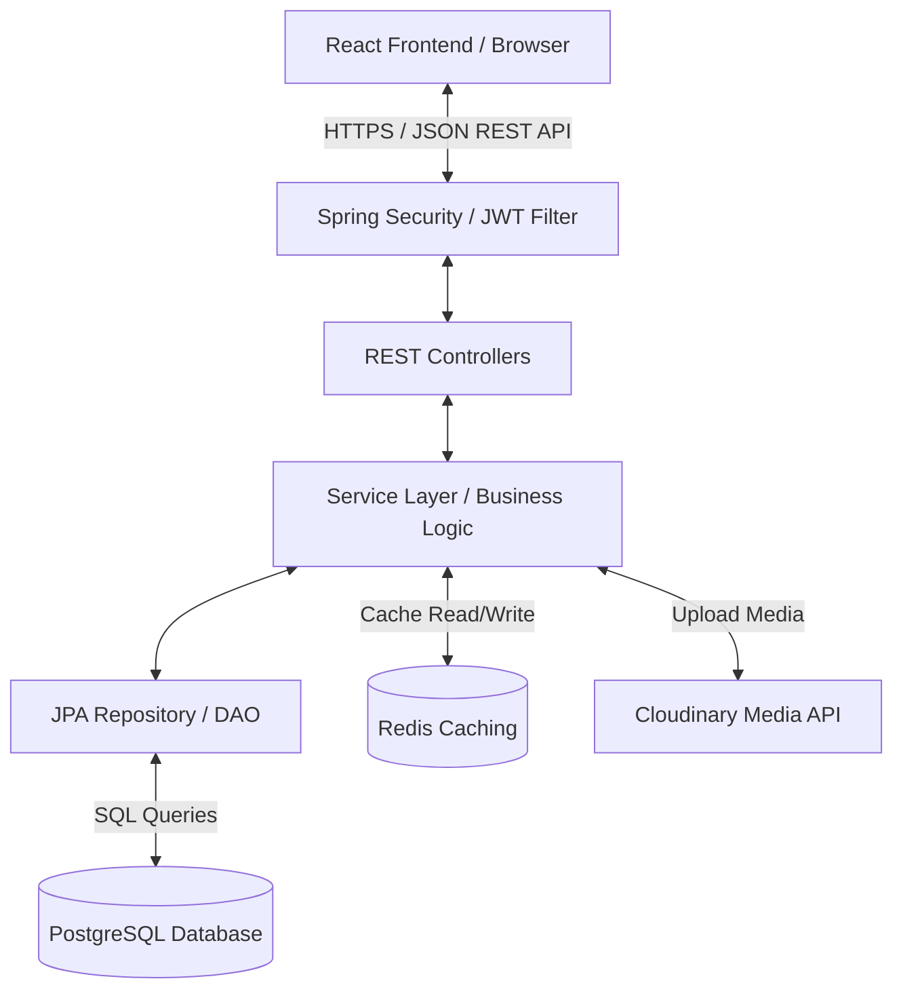
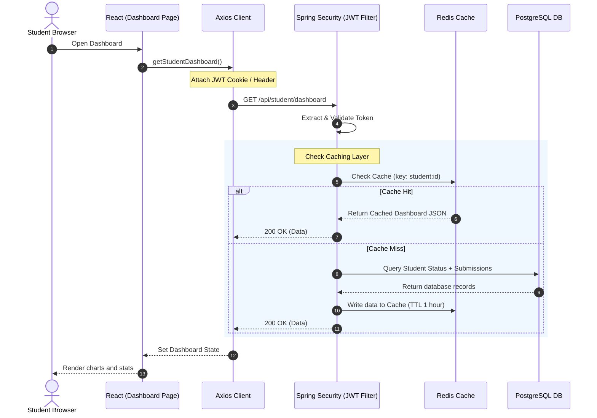

# 2. Project Architecture

The Xebia Assignment Management System (XAMS) is designed as a decoupled, multi-layered full-stack application. It uses a **Client-Server Architecture** with a stateless REST API backend and a state-managed single-page application (SPA) frontend.

## 2.1 Overall Architecture

The system comprises three primary modules:
1. **Presentation Layer (Client)**: A React-based Single Page Application (SPA).
2. **Application Layer (Server)**: A Spring Boot framework containing business logic, validation rules, and caching managers.
3. **Data Layer**: A relational PostgreSQL database for persistent records, accompanied by a Redis instance for temporary cache blocks.

---

## 2.2 Client-Server Architecture
XAMS relies on asynchronous, stateless HTTP communications. 
* The **Frontend** runs inside the user's web browser, executing React components and styling UI elements dynamically. It stores JWT tokens in security-safe contexts or HTTP-Only cookies, attaching them to subsequent requests.
* The **Backend** receives these HTTP requests, validates the JWT, processes the operations, and responds with a standard payload structure (`ApiResponse<T>`) containing JSON data and status codes.

---

## 2.3 Layered Architecture (Backend)
The backend follows a classic **Layered Architecture** to achieve clean separation of concerns:

1. **Controller Layer (REST API)**: Receives HTTP requests, parses path/query parameters, validates incoming DTOs using `@Valid`, and delegates task execution to the Service Layer.
2. **Service Layer (Business Logic)**: Implements core business logic. It reads and writes data through Repositories, performs mappings (DTO to Entity and vice versa) using MapStruct, manages transactions with `@Transactional`, and triggers caching policies using Redis.
3. **Repository Layer (Data Access)**: Extends Spring Data JPA interfaces (`JpaRepository`) to generate SQL queries automatically. It interacts directly with the PostgreSQL database.

---

## 2.4 MVC Pattern Implementation
Although the backend is stateless (does not serve JSP/HTML views), the system adapts the MVC pattern across the full stack:

* **Model**: Represented by JPA Entities (`Student`, `Teacher`, `Assignment`, `Submission`, `Batch`) in the backend, and TypeScript Types (`User`, `Assignment`, `Submission`) in the frontend.
* **View**: Represented by React Components (`Card`, `Badge`, `Sidebar`, `Table`) that render the state into the browser DOM.
* **Controller**: Managed by Spring REST Controllers (`AssignmentController`, `AuthController`) which handle endpoints, and React Hooks/Redux Slices which coordinate frontend actions.

---

## 2.5 Request Flow & Data Flow
A typical data flow is illustrated below when a Student retrieves their dashboard content:

### Flow Details:
1. **Frontend Request**: The React dashboard triggers an API call on mount.
2. **Security Interception**: Spring Security's `JwtAuthenticationFilter` intercepts the request, checks for cookie `JWT_TOKEN`, extracts the email, fetches user details, and populates the `SecurityContext`.
3. **Business & Cache Processing**: The dashboard service checks the Redis cache. If absent, it queries PostgreSQL, maps entities to DTOs, saves the DTO to Redis, and returns it.
4. **UI Update**: The frontend receives the successful payload, updates the Redux store, and re-renders the DOM, triggering smooth animations.
