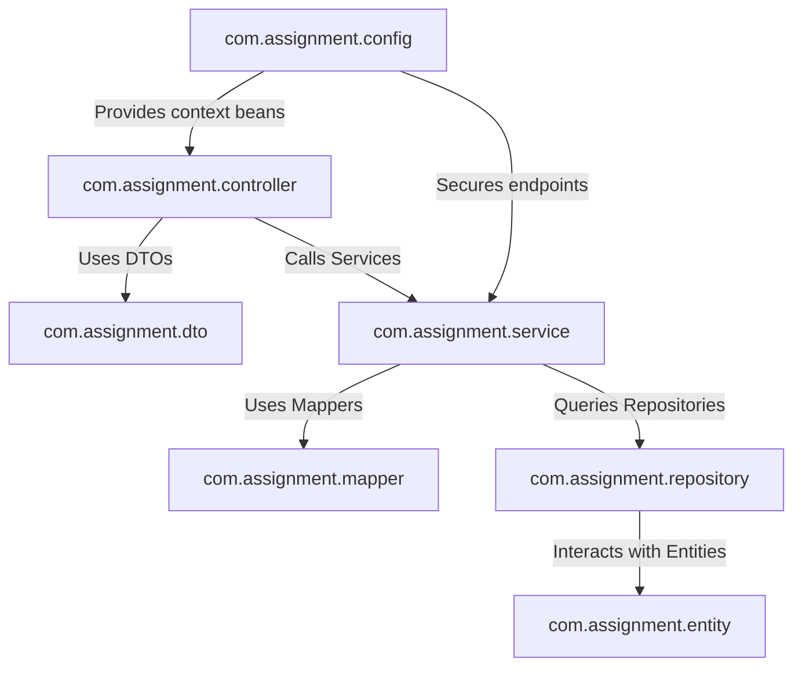

# 6. Backend Package Structure

The backend application is written in Java 21 using Spring Boot. It uses a package structure designed to enforce clean coding guidelines, modularity, and compile-time boundaries.

---

## 6.1 Architectural Packages

Below is a detailed map of the java package layer system under `src/main/java/com/assignment`:

---

## 6.2 Packages Breakdown & Goals

### 1. `com.assignment` (Root Package)
* **Goal**: Entry point for execution. Contains `AssignmentManagementApplication.java`.
* **Details**: Houses the main annotation `@SpringBootApplication`, which initiates component scanning, auto-configuration lookup, and sets up the Spring context.

### 2. `com.assignment.config` (Configuration Layer)
* **Goal**: Instantiates bean configs and filters.
* **Responsibilities**:
  * `SecurityConfig.java`: Configures REST API protection rules and exception handovers.
  * `JwtAuthenticationFilter.java` & `JwtService.java`: Evaluates tokens and populates `SecurityContext`.
  * `RedisConfig.java`: Establishes cache serializers.
  * `CloudinaryConfig.java`: Registers credential profiles for file uploads.

### 3. `com.assignment.controller` (Presentation / API Gateway)
* **Goal**: Maps URLs to Java methods.
* **Responsibilities**: Translates incoming requests, triggers validators (`@Valid`), handles multipart uploads, and converts outputs into a standardized HTTP wrapper (`ApiResponse`).

### 4. `com.assignment.dto` (Data Transfer Objects)
* **Goal**: Network data transport encapsulation.
* **Responsibilities**: Formulates requests and response mappings, decoupling database columns from JSON outputs.
* **Packages**:
  * `com.assignment.dto.request`: Classes like `LoginRequest`, `StudentSubmitRequest`.
  * `com.assignment.dto.response`: Classes like `AuthResponse`, `TeacherDashboardResponse`.

### 5. `com.assignment.entity` (Domain Model Layer)
* **Goal**: Maps Java objects to database tables (ORM).
* **Responsibilities**: Utilizes Jakarta Persistence annotations (`@Entity`, `@Table`, `@Id`) to map domain entities (`Teacher`, `Student`, `Batch`, `Assignment`, `Submission`) to PostgreSQL tables.

### 6. `com.assignment.enums` (Domain Constants)
* **Goal**: Type safety for state columns.
* **Classes**:
  * `Role`: `STUDENT`, `TEACHER`.
  * `AssignmentStatus`: `ACTIVE`, `INACTIVE`.
  * `SubmissionStatus`: `PENDING`, `REVIEWED`.
  * `AssignmentType`: `FILE_UPLOAD`, `URL_SUBMISSION`, `TEXT_ONLY`.

### 7. `com.assignment.exception` (Error Boundary Layer)
* **Goal**: Custom exceptions and handler.
* **Responsibilities**: Maps Java runtime errors to structured REST responses with appropriate HTTP status codes using `@RestControllerAdvice`.

### 8. `com.assignment.mapper` (Object Mapping Layer)
* **Goal**: Decouples DB entities from API DTOs.
* **Responsibilities**: MapStruct interfaces that automatically generate conversions (e.g. mapping `Assignment` entity to `AssignmentResponse` DTO) during compile time.

### 9. `com.assignment.repository` (Data Access Layer)
* **Goal**: Queries database.
* **Responsibilities**: Interfaces extending `JpaRepository` to perform CRUD operations, generate custom SQL statements, and execute entity joins.

### 10. `com.assignment.security` (Identity Verification)
* **Goal**: Adapts database users to Spring Security model.
* **Responsibilities**: Contains `CustomUserDetailsService` to verify emails and fetch authorities.

### 11. `com.assignment.service` (Business Core Layer)
* **Goal**: Encapsulates core business transactions.
* **Responsibilities**: Holds interfaces defining API business methods and implements them in `/impl` sub-folders, wrapping database transactions in `@Transactional` blocks.
