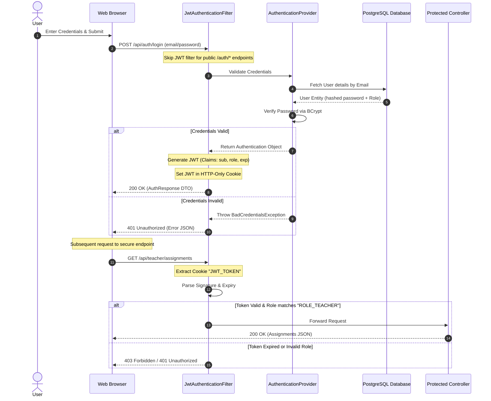

# 9. Authentication & Authorization

This section describes the authentication and authorization design in XAMS, showing how JWT, Spring Security filters, and HTTP-Only cookies secure user data.

---

## 9.1 Authentication & Authorization Flow

Below is a detailed sequence diagram showing the token validation and role check workflow:

---

## 9.2 Key Security Features

### 1. Password Hashing (BCrypt)
* Core security is managed using the `BCryptPasswordEncoder` bean.
* BCrypt implements salt generation dynamically. The salt is embedded within the generated hash string, protecting stored user records against lookup table attacks (rainbow tables).

### 2. Stateless JSON Web Tokens (JWT)
The JWT token structure includes:
* **Header**: Defines the HMAC-SHA256 signature algorithm.
* **Payload (Claims)**: Stores user details:
  * `sub` (Subject): The user's registered email address.
  * `role`: User role (`TEACHER` or `STUDENT`).
  * `iat` (Issued At): UNIX timestamp.
  * `exp` (Expiration): Set to 24 hours.
* **Signature**: Securely signed using a 256-bit secret key.

### 3. Stateless HTTP-Only Cookie Storage
XAMS stores the JWT token in an **HTTP-Only Cookie**:
* **XSS Protection**: By configuring the cookie as `httpOnly = true`, browser-side JavaScript scripts (like `document.cookie`) cannot read the token, protecting the system against Cross-Site Scripting (XSS) token theft.
* **CSRF Mitigation**: To support cross-origin browser requests, the system configures CORS credentials permissions and uses stateless Bearer authentication headers as a secondary option for REST consumers.

### 4. Role-Based Access Control (RBAC)
Authorizations are configured in the `SecurityConfig` filter chain:
* Paths starting with `/api/auth/**` are set to `permitAll()`.
* Paths starting with `/api/teacher/**` require authority rules checking for `ROLE_TEACHER`.
* Paths starting with `/api/student/**` require authority rules checking for `ROLE_STUDENT`.
* Any other route requests require generic authentication.
