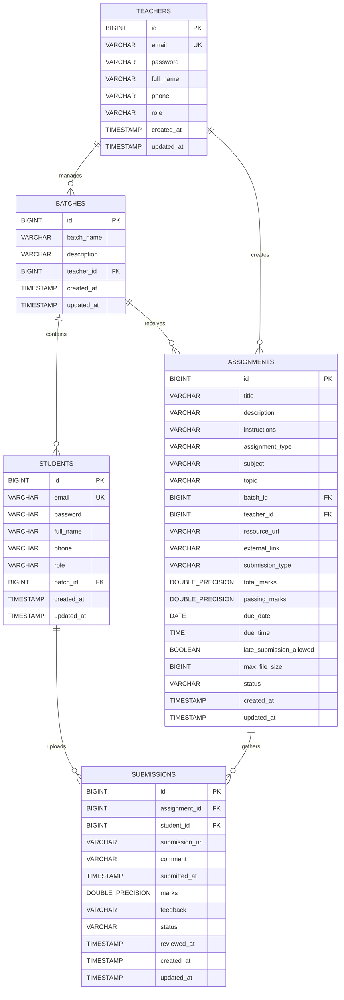

# 10. Database Schema Design

This section documents the relational database design for the **Xebia Assignment Management System (XAMS)**. It highlights tables, columns, indexes, data types, and relational foreign constraints.

---

## 10.1 Entity-Relationship (ER) Diagram

---

## 10.2 Table Schema Specifications

### 1. `teachers`
Stores profile credentials and identity roles for instructor accounts.
* **id**: `BIGINT` (Primary Key, Auto-increment)
* **email**: `VARCHAR(255)` (Unique Constraint, Not Null)
* **password**: `VARCHAR(255)` (Not Null)
* **full_name**: `VARCHAR(255)` (Not Null)
* **phone**: `VARCHAR(20)` (Nullable)
* **role**: `VARCHAR(50)` (Not Null - Default: `TEACHER`)
* **created_at** & **updated_at**: `TIMESTAMP` (Not Null)

### 2. `batches`
Stores academic student batches defined by Teachers.
* **id**: `BIGINT` (Primary Key, Auto-increment)
* **batch_name**: `VARCHAR(255)` (Not Null)
* **description**: `VARCHAR(500)` (Nullable)
* **teacher_id**: `BIGINT` (Foreign Key referencing `teachers(id)`, Not Null)
* **created_at** & **updated_at**: `TIMESTAMP` (Not Null)

### 3. `students`
Stores student accounts. Each student can belong to one batch.
* **id**: `BIGINT` (Primary Key, Auto-increment)
* **email**: `VARCHAR(255)` (Unique Constraint, Not Null)
* **password**: `VARCHAR(255)` (Not Null)
* **full_name**: `VARCHAR(255)` (Not Null)
* **phone**: `VARCHAR(20)` (Nullable)
* **role**: `VARCHAR(50)` (Not Null - Default: `STUDENT`)
* **batch_id**: `BIGINT` (Foreign Key referencing `batches(id)`, Nullable)
* **created_at** & **updated_at**: `TIMESTAMP` (Not Null)

### 4. `assignments`
Stores assignment specifications created by Teachers.
* **id**: `BIGINT` (Primary Key, Auto-increment)
* **title**: `VARCHAR(255)` (Not Null)
* **description**: `VARCHAR(2000)` (Nullable)
* **instructions**: `VARCHAR(2000)` (Nullable)
* **assignment_type**: `VARCHAR(50)` (Not Null)
* **subject**: `VARCHAR(100)` (Not Null)
* **topic**: `VARCHAR(100)` (Nullable)
* **batch_id**: `BIGINT` (Foreign Key referencing `batches(id)`, Not Null)
* **teacher_id**: `BIGINT` (Foreign Key referencing `teachers(id)`, Not Null)
* **resource_url**: `VARCHAR(500)` (Nullable) - *Attachment file URL*
* **external_link**: `VARCHAR(500)` (Nullable)
* **submission_type**: `VARCHAR(50)` (Nullable)
* **total_marks**: `DOUBLE PRECISION` (Not Null)
* **passing_marks**: `DOUBLE PRECISION` (Not Null)
* **due_date**: `DATE` (Not Null)
* **due_time**: `TIME` (Not Null)
* **late_submission_allowed**: `BOOLEAN` (Not Null - Default: `false`)
* **max_file_size**: `BIGINT` (Not Null - Default: `10MB`)
* **status**: `VARCHAR(50)` (Not Null - Default: `ACTIVE`)
* **created_at** & **updated_at**: `TIMESTAMP` (Not Null)

### 5. `submissions`
Stores submission records uploaded by students, along with grades and feedback.
* **id**: `BIGINT` (Primary Key, Auto-increment)
* **assignment_id**: `BIGINT` (Foreign Key referencing `assignments(id)`, Not Null)
* **student_id**: `BIGINT` (Foreign Key referencing `students(id)`, Not Null)
* **submission_url**: `VARCHAR(500)` (Nullable) - *Uploaded file URL*
* **comment**: `VARCHAR(1000)` (Nullable)
* **submitted_at**: `TIMESTAMP` (Nullable)
* **marks**: `DOUBLE PRECISION` (Nullable)
* **feedback**: `VARCHAR(1000)` (Nullable)
* **status**: `VARCHAR(50)` (Not Null - Default: `PENDING`)
* **reviewed_at**: `TIMESTAMP` (Nullable)
* **created_at** & **updated_at**: `TIMESTAMP` (Not Null)

---

## 10.3 Normalization & Constraints
* **Normalization**: The database schema meets **Third Normal Form (3NF)** requirements. Entity attributes depend solely on the primary keys, and transitive dependencies are eliminated (e.g. students refer only to `batch_id`, while batch details are isolated in the `batches` table).
* **Cascade Deletes**:
  * Deleting an assignment cascades deletes to all child `submissions` (`cascade = CascadeType.ALL, orphanRemoval = true`).
  * Deleting a teacher cascades deletes to all managed `batches` and `assignments`.
