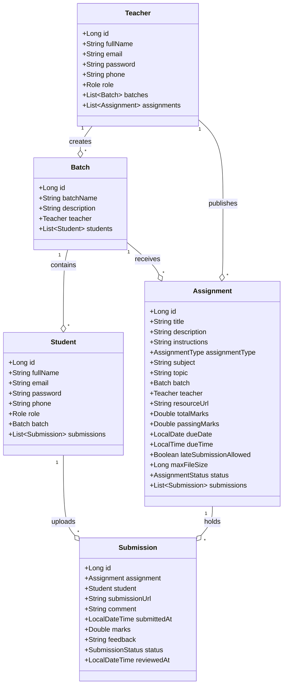
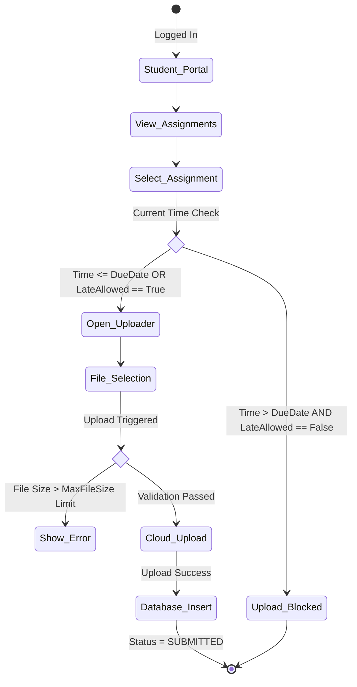
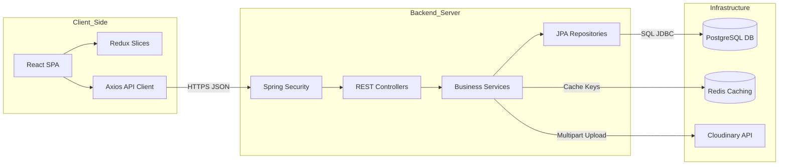

# 18. UML Diagrams

This section presents the Unified Modeling Language (UML) specifications mapping structural elements, actors, deployment topologies, and workflows in the **XAMS** portal, rendered using Mermaid.

---

## 18.1 Use Case Diagram

Defines the interactions between Student and Teacher actors and the system's core features:

```mermaid
left-to-right-direction
graph TD
    Teacher((Teacher Actor))
    Student((Student Actor))

    subgraph Authentication_Module
        UC_Register[Register Account]
        UC_Login[Login Portal]
        UC_Profile[Manage Profile]
    end

    subgraph Teacher_Workspace
        UC_CreateBatch[Create Batch]
        UC_AddStudent[Enroll Student]
        UC_CreateAssignment[Create Assignment]
        UC_GradeSubmission[Review & Grade Submission]
    end

    subgraph Student_Workspace
        UC_ViewAssignments[View Assigned Tasks]
        UC_SubmitAssignment[Submit File Solution]
        UC_ViewProgress[View Progress & Grades]
    end

    Teacher --> UC_Register
    Teacher --> UC_Login
    Teacher --> UC_Profile
    Teacher --> UC_CreateBatch
    Teacher --> UC_AddStudent
    Teacher --> UC_CreateAssignment
    Teacher --> UC_GradeSubmission

    Student --> UC_Register
    Student --> UC_Login
    Student --> UC_Profile
    Student --> UC_ViewAssignments
    Student --> UC_SubmitAssignment
    Student --> UC_ViewProgress
```

---

## 18.2 Class Diagram

Represents the core entity model in the database layer and their properties:



---

## 18.3 Activity Diagram (Submission Lifecycle)

Illustrates the flow of checking deadlines, validations, and status updates:



---

## 18.4 Component Diagram

Maps the structural components and third-party integrations:


