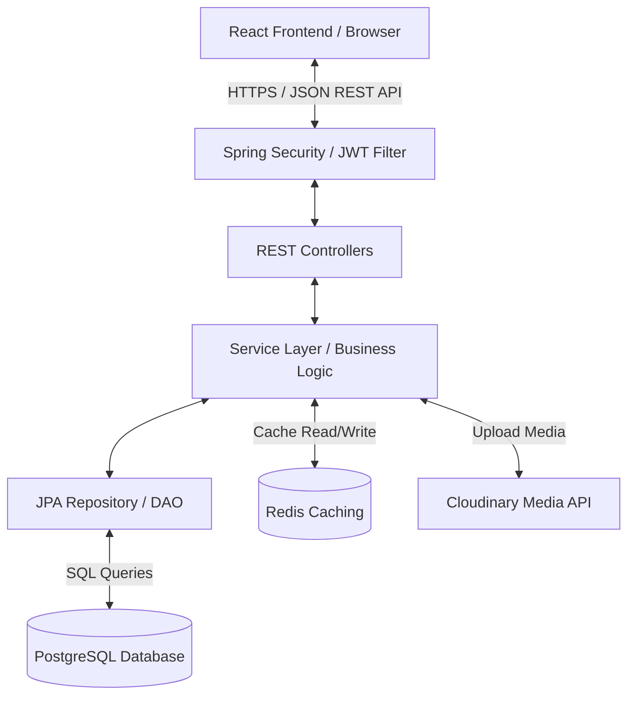
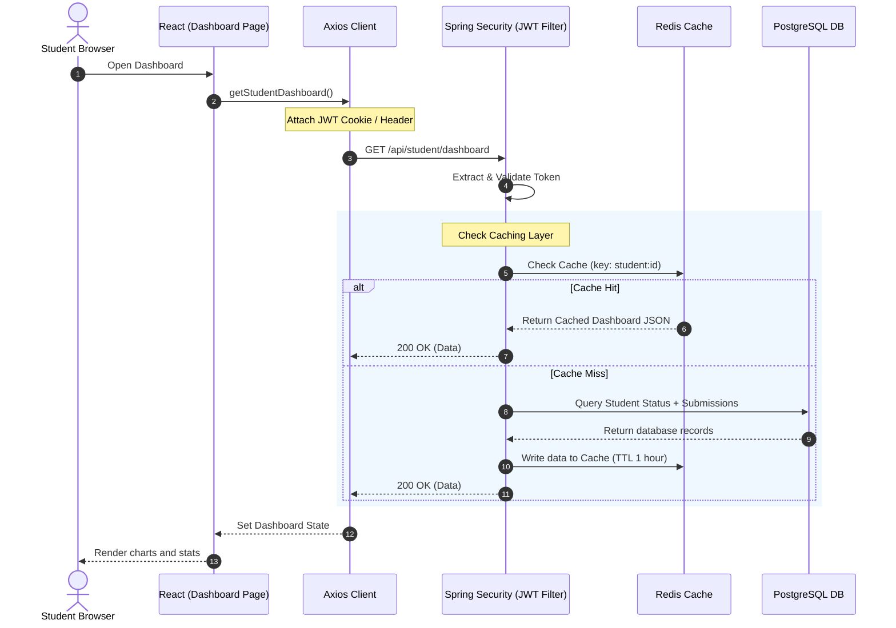
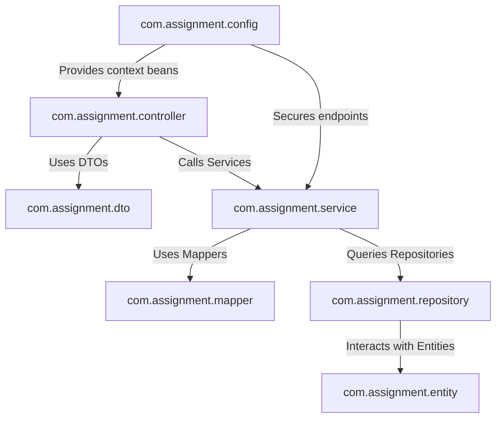
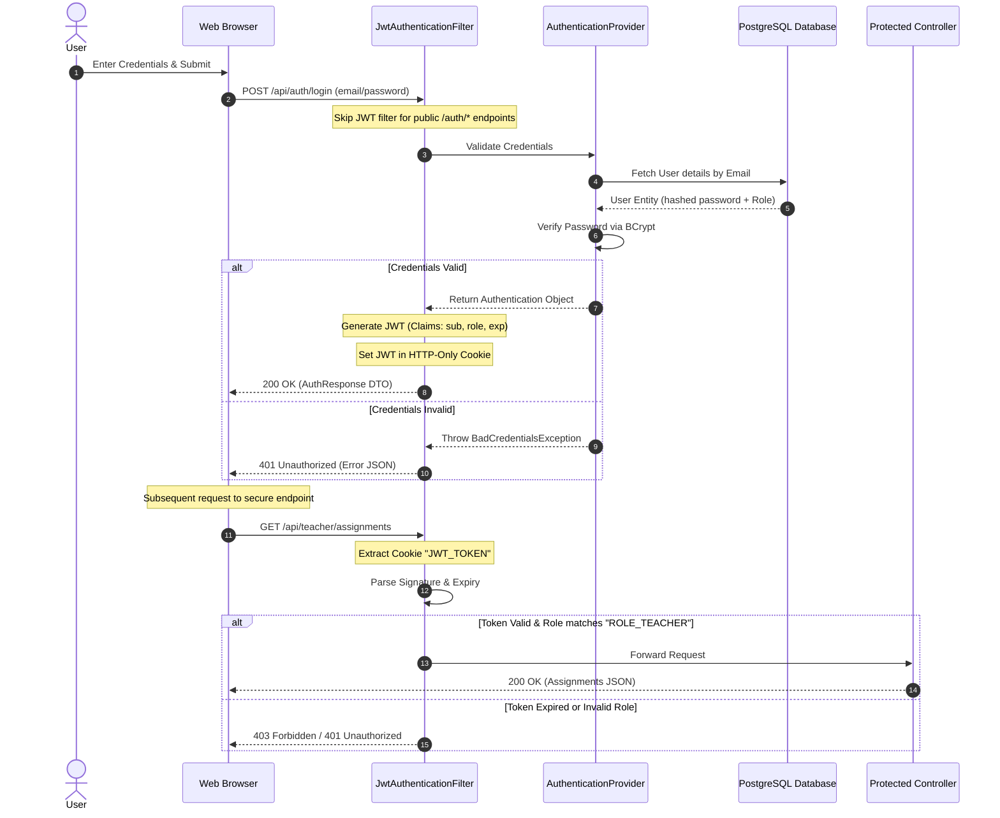
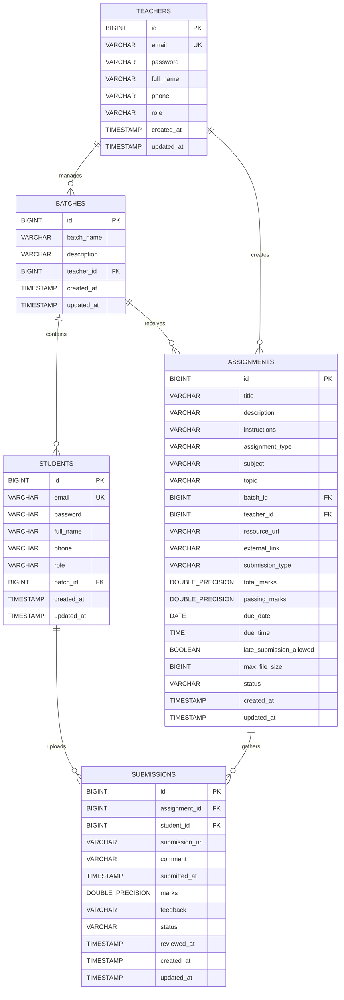
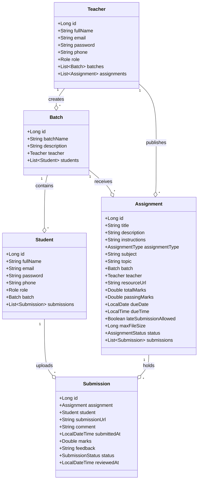
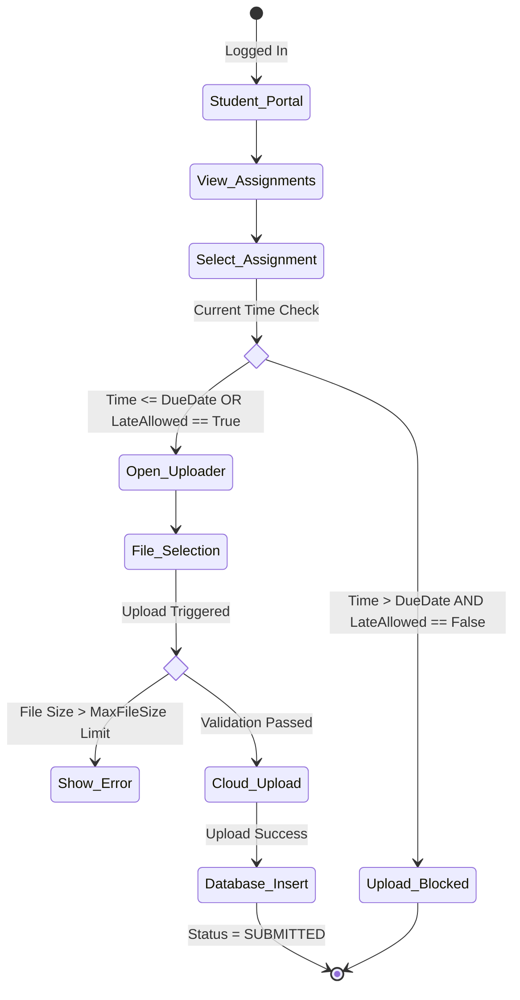
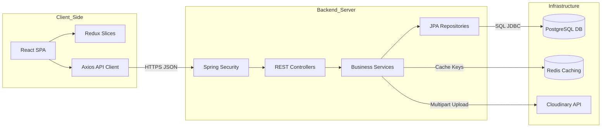

# 1. Project Overview

## 1.1 Project Name
The project is officially named the **Xebia Assignment Management System (XAMS)**.

## 1.2 Introduction
In academic environments, assignment management is a core process that influences student learning and faculty evaluation. The **Xebia Assignment Management System (XAMS)** is a modern, enterprise-grade, full-stack web application designed to digitize, streamline, and optimize the lifecycle of academic assignments. 

Built using a high-performance **Spring Boot** backend and a responsive, state-driven **React** frontend, XAMS provides a role-based collaborative platform for Teachers and Students. It integrates database persistence (PostgreSQL), cloud-based media storage (Cloudinary), speed-optimized caching (Redis), and stateless session handling (JSON Web Tokens).

## 1.3 Problem Statement
Traditional academic institutions rely on legacy portals, email threads, or physical paper submissions for handling student homework, coding tasks, and project reports. This approach introduces major structural inefficiencies:
* **Fragmented Channels**: Teachers use emails, chat channels, or spreadsheets to distribute assignments, leading to missed deadlines and untracked submissions.
* **Lack of Visibility**: Students do not have a unified interface displaying active deadlines, passing thresholds, status updates, or graded feedback.
* **Manual grading tracking**: Teachers struggle to view all submissions for a particular batch, download attachments individually, record grades manually, and calculate batch averages.
* **Resource Waste**: Storing files locally on university hard drives creates memory bottlenecks, while lack of proper validation allows students to upload invalid or oversized documents.

## 1.4 Existing System
The existing system relies either on manual coordination (paper/email submission) or basic Learning Management Systems (LMS) that treat assignments as generic file posts. 

### Limitations of the Existing System:
1. **Inefficient file management**: Files are stored in unstructured local folders, creating risks of loss or unauthorized alterations.
2. **Poor deadline enforcement**: Checking if a submission was late requires teachers to manually compare file properties or email timestamps.
3. **No real-time analytics**: Administrators and instructors cannot easily see batch performance metrics, submission ratios, or failure rates.
4. **Weak session security**: Basic session-based logins make portals vulnerable to Cross-Site Request Forgery (CSRF) and session hijacking.
5. **No caching mechanism**: Submitting dashboard requests hits the database repeatedly, causing performance degradation under high load.

## 1.5 Proposed System
The proposed **Xebia Assignment Management System (XAMS)** resolves these issues by implementing a dedicated database structure and modern web practices:
* **Batch-Scoped Assignments**: Teachers create assignments mapped to specific student batches, ensuring that only enrolled students receive the tasks.
* **Cloud Storage Integration**: Submissions and instructions are automatically uploaded to Cloudinary, ensuring highly available, secure cloud access.
* **Stateless Token Authentication**: Implements JSON Web Tokens (JWT) stored in HTTP-Only cookies to secure APIs and manage roles.
* **Redis Caching**: Caches user dashboards and batch statistics to reduce PostgreSQL database load by up to 80%.
* **Rich UI Dashboards**: Provides interactive screens showing pending submissions, grades, deadlines, and charts.

## 1.6 Objectives
* **Automation**: Automate assignment distribution, status updates, and grading workflows.
* **Security**: Enforce role-based access control, preventing students from editing assignments or viewing peers' submissions.
* **Performance**: Maintain low latency (sub-100ms) for dashboard queries using Redis caching.
* **Scalability**: Design a decoupled system where the React client and Spring Boot server communicate entirely over JSON REST APIs.

## 1.7 Scope
The scope of XAMS covers the complete assignment workflow:
1. **Authentication**: Sign up and secure login for Teachers and Students.
2. **Batch Management**: Teachers create batches and enroll students.
3. **Assignment Lifecycle**: Creation, publication, editing, submission, grading, and status transition.
4. **Cloud Media Management**: Automated secure uploads of PDFs, images, and text files.
5. **Insights**: Dashboards showing metrics (e.g., submission rates, pass/fail counters).

## 1.8 Key Features
* **Role-Based Access**: Dedicated dashboards for Teachers (manage batches, assign homework, score submissions) and Students (view tasks, upload files, read grades).
* **Flexible Assignments**: Supports various formats (code file upload, links, text comments) with configurable deadlines and point systems.
* **Automated Status Checking**: Real-time evaluation of deadlines (marking late submissions if allowed, blocking if disabled).
* **Interactive Dashboard Widgets**: Visual progress bars, color-coded badges, and summary cards.

## 1.9 Benefits
* **For Teachers**: Reduced administration time, organized submissions, central grading console, and simple batch monitoring.
* **For Students**: Clear deadlines, transparent grading metrics, immediate feedback, and simple upload features.
* **For Institutions**: Centralized records, paperless workflows, high security, and low operational overhead.

## 1.10 Technologies Used

### Frontend Stack:
* **UI Library**: React 19 (Vite-based compilation)
* **Language**: TypeScript (strict type checking)
* **Styling**: Tailwind CSS (responsive layouts)
* **State Management**: Redux Toolkit (global state slices)
* **Routing**: React Router DOM v7
* **Form & Validation**: React Hook Form with Zod schema verification
* **HTTP Client**: Axios (with credentials and header interceptors)

### Backend Stack:
* **Core Framework**: Spring Boot 3.3.1 (Java 21)
* **Security**: Spring Security & JSON Web Tokens (JJWT)
* **Data Access**: Spring Data JPA with Hibernate
* **Mapping Utility**: MapStruct 1.5.5.Final
* **Boilerplate Reduction**: Project Lombok 1.18.30
* **Caching Layer**: Spring Data Redis
* **Database**: PostgreSQL
* **Media Provider**: Cloudinary SDK

## 1.11 System Requirements

### Software Requirements:
* **Operating System**: Windows 10/11, macOS, or Linux (Ubuntu 20.04+)
* **Java Development Kit (JDK)**: JDK 21
* **Node.js Environment**: Node.js v18+ & npm v10+
* **Database Systems**: PostgreSQL 15+, Redis 7+
* **Build Systems**: Apache Maven 3.9+, Vite 8+
* **Web Browser**: Google Chrome, Mozilla Firefox, or Microsoft Edge

### Hardware Requirements (Development / Deployment):
* **CPU**: Dual-Core Core i5 / AMD Ryzen 5 or higher
* **RAM**: 8 GB minimum (16 GB recommended for running Backend + Database + Redis + Frontend locally)
* **Disk Space**: 500 MB for source code; additional gigabytes for database growth
* **Network**: Broadband internet connection for CDN assets and Cloudinary file transfers


---


# 2. Project Architecture

The Xebia Assignment Management System (XAMS) is designed as a decoupled, multi-layered full-stack application. It uses a **Client-Server Architecture** with a stateless REST API backend and a state-managed single-page application (SPA) frontend.

## 2.1 Overall Architecture



The system comprises three primary modules:
1. **Presentation Layer (Client)**: A React-based Single Page Application (SPA).
2. **Application Layer (Server)**: A Spring Boot framework containing business logic, validation rules, and caching managers.
3. **Data Layer**: A relational PostgreSQL database for persistent records, accompanied by a Redis instance for temporary cache blocks.

---

## 2.2 Client-Server Architecture
XAMS relies on asynchronous, stateless HTTP communications. 
* The **Frontend** runs inside the user's web browser, executing React components and styling UI elements dynamically. It stores JWT tokens in security-safe contexts or HTTP-Only cookies, attaching them to subsequent requests.
* The **Backend** receives these HTTP requests, validates the JWT, processes the operations, and responds with a standard payload structure (`ApiResponse<T>`) containing JSON data and status codes.

---

## 2.3 Layered Architecture (Backend)
The backend follows a classic **Layered Architecture** to achieve clean separation of concerns:

1. **Controller Layer (REST API)**: Receives HTTP requests, parses path/query parameters, validates incoming DTOs using `@Valid`, and delegates task execution to the Service Layer.
2. **Service Layer (Business Logic)**: Implements core business logic. It reads and writes data through Repositories, performs mappings (DTO to Entity and vice versa) using MapStruct, manages transactions with `@Transactional`, and triggers caching policies using Redis.
3. **Repository Layer (Data Access)**: Extends Spring Data JPA interfaces (`JpaRepository`) to generate SQL queries automatically. It interacts directly with the PostgreSQL database.

---

## 2.4 MVC Pattern Implementation
Although the backend is stateless (does not serve JSP/HTML views), the system adapts the MVC pattern across the full stack:

* **Model**: Represented by JPA Entities (`Student`, `Teacher`, `Assignment`, `Submission`, `Batch`) in the backend, and TypeScript Types (`User`, `Assignment`, `Submission`) in the frontend.
* **View**: Represented by React Components (`Card`, `Badge`, `Sidebar`, `Table`) that render the state into the browser DOM.
* **Controller**: Managed by Spring REST Controllers (`AssignmentController`, `AuthController`) which handle endpoints, and React Hooks/Redux Slices which coordinate frontend actions.

---

## 2.5 Request Flow & Data Flow
A typical data flow is illustrated below when a Student retrieves their dashboard content:



### Flow Details:
1. **Frontend Request**: The React dashboard triggers an API call on mount.
2. **Security Interception**: Spring Security's `JwtAuthenticationFilter` intercepts the request, checks for cookie `JWT_TOKEN`, extracts the email, fetches user details, and populates the `SecurityContext`.
3. **Business & Cache Processing**: The dashboard service checks the Redis cache. If absent, it queries PostgreSQL, maps entities to DTOs, saves the DTO to Redis, and returns it.
4. **UI Update**: The frontend receives the successful payload, updates the Redux store, and re-renders the DOM, triggering smooth animations.


---


# 3. Folder Structure Rationale

This section details the physical layout of the **Xebia Assignment Management System (XAMS)** repository. It explains the responsibilities, dependencies, and best practices associated with each folder and key configuration files.

---

## 3.1 Overall Repository Layout
At the root level, the project is divided into two main subdirectories:
* **`Backend`**: Contains the Spring Boot Java source code, tests, and Maven configuration.
* **`frontend`**: Contains the React, TypeScript, Vite, and Tailwind CSS source code.
* **`documentation`**: Holds the comprehensive system documentation files.

---

## 3.2 Backend Directory Structure (`/Backend`)

The backend follows the Spring Boot standard folder conventions:

```text
Backend/
├── pom.xml                                 # Maven dependencies and build configuration
└── src/
    ├── main/
    │   ├── java/com/assignment/
    │   │   ├── AssignmentManagementApplication.java # Spring Boot entry application
    │   │   ├── config/                     # Configuration classes (Security, JWT, Redis, Cloudinary)
    │   │   ├── controller/                 # REST Controllers (Endpoints)
    │   │   ├── dto/                        # Data Transfer Objects (Requests & Responses)
    │   │   ├── entity/                     # JPA Entities (PostgreSQL mapping)
    │   │   ├── enums/                      # Enum types (Role, Status)
    │   │   ├── exception/                  # Custom Exceptions & Global Exception Handler
    │   │   ├── mapper/                     # MapStruct interfaces for Entity-DTO conversion
    │   │   ├── repository/                 # Spring Data JPA Repository interfaces
    │   │   ├── security/                   # Custom UserDetails Service
    │   │   └── service/                    # Business Logic Interfaces and Implementations
    │   └── resources/
    │       └── application.properties       # Database, Redis, JWT & Cloudinary settings
    └── test/
        └── java/com/assignment/
            └── AssignmentManagementApplicationTests.java # Context loading tests
```

### Folder Breakdown & Responsibilities:
1. **`config/`**:
   * *Purpose*: Configures system middleware and security filters.
   * *Dependencies*: Spring Core, Spring Security, Redis, Cloudinary SDK.
   * *Best Practices*: Keep configuration modular. E.g., separate Redis caching settings from REST API security configuration.
2. **`controller/`**:
   * *Purpose*: Exposes REST end-points and maps HTTP operations.
   * *Dependencies*: DTOs, Services, Spring Web annotations.
   * *Best Practices*: Do not write business logic here. Delegate immediately to the service layer.
3. **`dto/`**:
   * *Purpose*: Defines simple data containers for request payloads and response structures.
   * *Best Practices*: Separate request payloads (e.g., `LoginRequest`) from response payloads (e.g., `AuthResponse`) to prevent model pollution.
4. **`entity/`**:
   * *Purpose*: Defines database tables mapping to Hibernate.
   * *Best Practices*: Define table and column names explicitly using `@Table` and `@Column` annotations to avoid system default mapping errors.
5. **`exception/`**:
   * *Purpose*: Centralized error tracking, translating native exceptions to clean HTTP 4xx/5xx responses.
   * *Best Practices*: Create a generic `CustomException` parent, extending it for specific issues like `ResourceNotFoundException`.
6. **`mapper/`**:
   * *Purpose*: Auto-generates mapping logic between DTOs and database Entities.
   * *Dependencies*: MapStruct annotation processor.
7. **`repository/`**:
   * *Purpose*: Performs CRUD database operations.
   * *Dependencies*: JPA Entities.
8. **`service/`**:
   * *Purpose*: Implements core logic and coordinates database transactions.
   * *Best Practices*: Program to interfaces. Keep interfaces inside `service/` and concrete classes inside `service/impl/`.

---

## 3.3 Frontend Directory Structure (`/frontend`)

The frontend conforms to modern React + Vite layouts:

```text
frontend/
├── package.json                            # Scripts, dependencies, and build specs
├── tsconfig.json                           # TypeScript compiler guidelines
├── vite.config.ts                          # Vite build-bundler configurations
├── tailwind.config.js                      # Tailwind design configurations
├── index.html                              # Root HTML anchor page
└── src/
    ├── main.tsx                            # Root script bootstrapping React DOM
    ├── App.tsx                             # Main router and global contexts provider
    ├── index.css                           # Global styles and Tailwind base imports
    ├── assets/                             # Local images and icons
    ├── components/
    │   ├── layout/                         # Structural frames (Header, Sidebar, Layout wrapper)
    │   ├── shared/                         # Reusable components (Pagination, ProtectedRoutes, Loaders)
    │   └── ui/                             # Primitive styling controls (Badge, Button, Card, Modal)
    ├── contexts/                           # React Context API states (AuthContext, ThemeContext)
    ├── pages/
    │   ├── auth/                           # Student and Teacher login portals
    │   ├── student/                        # Student-specific screens
    │   └── teacher/                        # Teacher-specific management portals
    ├── services/                           # Axios api wrappers
    ├── store/                              # Redux slices and store configs
    ├── types/                              # TypeScript interfaces for entity mapping
    └── utils/                              # Shared helper and date-formatting routines
```

### Folder Breakdown & Responsibilities:
1. **`components/ui/`**:
   * *Purpose*: Atom components (buttons, badges, inputs) that are completely reusable across any page. They do not know about APIs or global state.
2. **`components/layout/`**:
   * *Purpose*: Controls UI layouts, providing responsive navigation bars and toggleable side panels.
3. **`contexts/`**:
   * *Purpose*: Manages light state values like theme modes or quick authentication pointers.
4. **`pages/`**:
   * *Purpose*: Contains page-level components that pull data from services, trigger Redux events, and render structures using UI and Layout folders.
5. **`services/`**:
   * *Purpose*: Houses Axios clients, handling server API calls. It handles errors and token forwarding.
6. **`store/`**:
   * *Purpose*: Redux store managing complex states (e.g., active batches).
7. **`utils/`**:
   * *Purpose*: Shared utility tools, such as converting ISO dates to friendly representations.


---


# 4. Frontend Documentation

The client-side of the XAMS portal is implemented as a single-page application (SPA) using React 19, TypeScript, Redux Toolkit, React Router DOM, and Tailwind CSS. It focuses on modular components, stateless component rendering, and custom React hooks.

---

## 4.1 Frontend Tech Stack & Architecture

* **React 19**: Serves as the core view engine. It utilizes the virtual DOM for rendering and handles components' lifecycles.
* **Redux Toolkit (RTK)**: Manages global asynchronous state variables (specifically academic batches and selection).
* **React Router DOM v7**: Directs user routing, dividing page modules into Public, Student, and Teacher sections.
* **Axios**: Executes HTTP calls. Configured with a response interceptor to handle session timeouts and authentication failures (status `401`).
* **React Hook Form & Zod**: Handles user input collections (e.g. signup, login, grading) with real-time validation schemas.

---

## 4.2 State Management & Store

Global states are organized using Redux slices. The main store compiles slices to expose clean dispatch hooks.

### Redux Slices:
1. **`batchSlice.ts`**:
   * *State Model*:
     * `batchList`: Array of batches mapped with student count.
     * `selectedBatch`: Currently active batch filtered in dashboard contexts.
     * `loading` & `error`: Status placeholders for asynchronous operation metrics.
   * *Thunk Methods*:
     * `getAllBatches()`: Fetches teacher-scoped batches and hits student API to retrieve batch sizes.
     * `getPublicBatches()`: Fetches batches available for public sign-up registration.
     * `createBatch()`: Posts new batch credentials to backend endpoints.
     * `deleteBatch()`: Dispatches delete REST calls, purging local store caches.

---

## 4.3 Context APIs

### 1. AuthContext (`AuthContext.tsx`)
Provides authentication state to children nodes, handling session caches via `localStorage` alongside HTTP-only cookies.
* *States*:
  * `user`: Profile fields (`fullName`, `email`, `role`, `enrollmentNumber`).
  * `isAuthenticated`: Boolean checks.
  * `loading`: Defer route checks during startup initialization.
* *Methods*:
  * `login(role, credentials)`: Standard login router. Calls `authService.login()`, saves details, and sets states.
  * `logout()`: Clears security context, calls backend logout APIs to clear the cookie, and redirects user to landing.

### 2. ThemeContext (`ThemeContext.tsx`)
Manages dark/light theme options, writing the active class configurations directly to the HTML document element root.
* *States*:
  * `theme`: `dark` | `light` options.
* *Methods*:
  * `toggleTheme()`: Swaps system visual flags and stores preferred modes in local settings.

---

## 4.4 Client Services Layer (API wrappers)

Axios routes are mapped to modular client wrappers under `/src/services`:

| File Name | Exposed Client Methods | Interacts With (Backend Envs) |
|---|---|---|
| `auth.service.ts` | `teacherLogin`, `teacherRegister`, `studentLogin`, `studentRegister`, `logout`, `getMe` | `/api/auth/*` |
| `batch.service.ts` | `getAllBatches`, `getBatchById`, `createBatch`, `updateBatch`, `deleteBatch`, `getPublicBatches` | `/api/teacher/batches/*` |
| `student.service.ts` | `getDashboardStats`, `getAssignments`, `getAssignmentById`, `submitAssignment`, `getLearningProgress` | `/api/student/*` |
| `teacher.service.ts` | `getDashboardStats`, `getAssignments`, `createAssignment`, `updateAssignment`, `deleteAssignment`, `getSubmissions` | `/api/teacher/*` |

---

## 4.5 Navigation & Guarded Routes

Guarded routes protect internal portals against unauthorized access:
* **`ProtectedRoute`**: Inspects user authorization rules. If the user's role is not validated (e.g. Student tries accessing `/teacher/*`), it redirects them to their respective home screen. If not authenticated, redirects to `/`.
* **`PublicRoute`**: Prevents logged-in sessions from loading auth screens, immediately forwarding active sessions to their specific role-based dashboards.


---


# 5. UI & Component Breakdown

The User Interface (UI) of XAMS features clean design guidelines with dark-mode support, micro-animations (transitions, hover effects), and fluid responsive adjustments for desktop, tablet, and mobile displays.

---

## 5.1 Shared & Layout Components

### 1. Sidebar (`Sidebar.tsx`)
* **Purpose**: Serves as the primary navigation bar. Lists paths based on roles.
* **Responsive Control**: Uses conditional Tailwind styles (`md:translate-x-0 -translate-x-full`) controlled by a state toggle. It slides out on mobile viewports.
* **Elements**: Features logo, list of links with Lucide icon markers, and a Logout button at the base.

### 2. Header (`Header.tsx`)
* **Purpose**: Renders the context header bar at the top of the screens.
* **Features**: Hamburger menu button (mobile-only), Page Title display, Dark Mode toggle button, user greeting, and user initials avatar.

### 3. Pagination Control (`Pagination.tsx`)
* **Purpose**: Divides large lists (assignments, students, submissions) into pages.
* **Props**: `currentPage`, `totalPages`, `onPageChange`.
* **Flow**: Renders numbered circles, "Prev" and "Next" buttons, disabling them on boundary pages.

### 4. Primitive Atoms (`/components/ui/`)
* **`Button.tsx`**: Flexible container wrapping HTML buttons. Supports `primary`, `secondary`, `danger`, and `outline` sizes with loading spinner state overlays.
* **`Card.tsx`**: Basic white/dark-neutral box wrapping borders. Provides standard padding structures.
* **`Badge.tsx`**: Small pills used for displaying status. Dynamically changes colors based on value:
  * Green for `reviewed` / `ACTIVE`
  * Orange/Yellow for `submitted` / `PENDING`
  * Gray/Red for `not_submitted` / `LATE`
* **`Modal.tsx`**: Backdrop overlay focusing portal content. Closes on backdrop click or ESC escape keys.

---

## 5.2 Teacher Interface Pages

### 1. Teacher Dashboard (`TeacherDashboard.tsx`)
* **Purpose**: Consolidated analytics viewport.
* **Widgets**:
  * Total Assignments Count Card.
  * Active Assignments Card.
  * Submitted Assignments Count (unreviewed metrics trigger orange accents).
  * Enrolled Students Count Card.
* **Interactive Elements**: Dropdown selection allowing filters to update stats based on selected active Batch.

### 2. Batch Management (`BatchManagement.tsx`)
* **Purpose**: Allows teachers to organize class divisions.
* **UI Structure**:
  * Left side: List of existing batches.
  * Right side: Batch Creation form (Zod validation for `batchName` and `description`).
  * Action modals: Lists students enrolled inside a selected batch.

### 3. Create & Edit Assignment (`CreateAssignment.tsx`)
* **Purpose**: Comprehensive form to design homework tasks.
* **Fields**:
  * Text inputs: Title, Subject, Topic, Instructions, Description.
  * Numbers: Total Marks, Passing Marks.
  * Dates & Times: Due Date calendar picker and Due Time field.
  * Checkboxes: Allow Late Submission.
  * File uploads: Drag-and-drop file uploader (PDF/Image/Document) interacting with the backend media service.
* **Validation**: Custom validation checks ensuring that `passingMarks` does not exceed `totalMarks`.

---

## 5.3 Student Interface Pages

### 1. Student Dashboard (`StudentDashboard.tsx`)
* **Purpose**: Central student workspace.
* **Widgets**:
  * Assignment Status Circle Progress Widget.
  * Pending Task List (prioritized by closest due dates).
  * Recent Grades Summary Panel.

### 2. Assignment Details & Submission (`AssignmentDetail.tsx`)
* **Purpose**: View instructions, download attachments, and upload submissions.
* **Layout**:
  * Left Column: Detailed description, instructions, max score limits, passing margins, and reference file download link.
  * Right Column: Submission box. Shows remaining time countdown. If not submitted, renders file upload field with text comment box. If submitted, displays file details, timestamp, grading score, and teacher feedback.

### 3. Learning Progress (`LearningProgress.tsx`)
* **Purpose**: Visual analytics showing grade history and performance over time.
* **UI Elements**:
  * Line Chart: Renders individual assignment scores against the batch averages.
  * Subject Summary Table: Displays subject-wise pass rates and average grades.


---


# 6. Backend Package Structure

The backend application is written in Java 21 using Spring Boot. It uses a package structure designed to enforce clean coding guidelines, modularity, and compile-time boundaries.

---

## 6.1 Architectural Packages

Below is a detailed map of the java package layer system under `src/main/java/com/assignment`:



---

## 6.2 Packages Breakdown & Goals

### 1. `com.assignment` (Root Package)
* **Goal**: Entry point for execution. Contains `AssignmentManagementApplication.java`.
* **Details**: Houses the main annotation `@SpringBootApplication`, which initiates component scanning, auto-configuration lookup, and sets up the Spring context.

### 2. `com.assignment.config` (Configuration Layer)
* **Goal**: Instantiates bean configs and filters.
* **Responsibilities**:
  * `SecurityConfig.java`: Configures REST API protection rules and exception handovers.
  * `JwtAuthenticationFilter.java` & `JwtService.java`: Evaluates tokens and populates `SecurityContext`.
  * `RedisConfig.java`: Establishes cache serializers.
  * `CloudinaryConfig.java`: Registers credential profiles for file uploads.

### 3. `com.assignment.controller` (Presentation / API Gateway)
* **Goal**: Maps URLs to Java methods.
* **Responsibilities**: Translates incoming requests, triggers validators (`@Valid`), handles multipart uploads, and converts outputs into a standardized HTTP wrapper (`ApiResponse`).

### 4. `com.assignment.dto` (Data Transfer Objects)
* **Goal**: Network data transport encapsulation.
* **Responsibilities**: Formulates requests and response mappings, decoupling database columns from JSON outputs.
* **Packages**:
  * `com.assignment.dto.request`: Classes like `LoginRequest`, `StudentSubmitRequest`.
  * `com.assignment.dto.response`: Classes like `AuthResponse`, `TeacherDashboardResponse`.

### 5. `com.assignment.entity` (Domain Model Layer)
* **Goal**: Maps Java objects to database tables (ORM).
* **Responsibilities**: Utilizes Jakarta Persistence annotations (`@Entity`, `@Table`, `@Id`) to map domain entities (`Teacher`, `Student`, `Batch`, `Assignment`, `Submission`) to PostgreSQL tables.

### 6. `com.assignment.enums` (Domain Constants)
* **Goal**: Type safety for state columns.
* **Classes**:
  * `Role`: `STUDENT`, `TEACHER`.
  * `AssignmentStatus`: `ACTIVE`, `INACTIVE`.
  * `SubmissionStatus`: `PENDING`, `REVIEWED`.
  * `AssignmentType`: `FILE_UPLOAD`, `URL_SUBMISSION`, `TEXT_ONLY`.

### 7. `com.assignment.exception` (Error Boundary Layer)
* **Goal**: Custom exceptions and handler.
* **Responsibilities**: Maps Java runtime errors to structured REST responses with appropriate HTTP status codes using `@RestControllerAdvice`.

### 8. `com.assignment.mapper` (Object Mapping Layer)
* **Goal**: Decouples DB entities from API DTOs.
* **Responsibilities**: MapStruct interfaces that automatically generate conversions (e.g. mapping `Assignment` entity to `AssignmentResponse` DTO) during compile time.

### 9. `com.assignment.repository` (Data Access Layer)
* **Goal**: Queries database.
* **Responsibilities**: Interfaces extending `JpaRepository` to perform CRUD operations, generate custom SQL statements, and execute entity joins.

### 10. `com.assignment.security` (Identity Verification)
* **Goal**: Adapts database users to Spring Security model.
* **Responsibilities**: Contains `CustomUserDetailsService` to verify emails and fetch authorities.

### 11. `com.assignment.service` (Business Core Layer)
* **Goal**: Encapsulates core business transactions.
* **Responsibilities**: Holds interfaces defining API business methods and implements them in `/impl` sub-folders, wrapping database transactions in `@Transactional` blocks.


---


# 7. Java Class Documentation

This section provides comprehensive details on the primary Java classes in the backend application, outlining annotations, public methods, parameters, return types, validations, and dependencies.

---

## 7.1 Controller Layer Classes

### 1. `AuthController`
* **Annotations**: `@RestController`, `@RequestMapping("/api/auth")`, `@RequiredArgsConstructor`
* **Dependencies**: `AuthService`
* **Purpose**: Coordinates access management (login, signup, logouts, batch queries).
* **Key Methods**:
  * `registerTeacher(@Valid @RequestBody TeacherRegisterRequest request, HttpServletResponse response)`: Registers a teacher, generates a JWT, sets it in an HTTP-only cookie, and returns `AuthResponse`.
  * `registerStudent(@Valid @RequestBody StudentRegisterRequest request, HttpServletResponse response)`: Registers a student and assigns them to a batch.
  * `login(@Valid @RequestBody LoginRequest request, HttpServletResponse response)`: Verifies user credentials (email/password) and sets the authentication cookie.
  * `logout(HttpServletResponse response)`: Clears the JWT cookie by setting its max age to zero.

### 2. `AssignmentController`
* **Annotations**: `@RestController`, `@RequestMapping("/api")`, `@RequiredArgsConstructor`
* **Dependencies**: `AssignmentService`
* **Purpose**: Maps URL routes for assignment creations, modifications, listings, and deletions.
* **Key Methods**:
  * `createAssignment(@Valid @ModelAttribute AssignmentRequest request)`: Handles multipart/form-data requests, parses fields, uploads attachment to Cloudinary, and saves the assignment.
  * `updateAssignment(@PathVariable Long id, @Valid @ModelAttribute AssignmentRequest request)`: Updates assignment parameters and handles file swaps.
  * `deleteAssignment(@PathVariable Long id)`: Removes the assignment and invalidates corresponding Redis caches.
  * `getStudentAssignments(...)`: Returns a page of assignments assigned to the calling student's batch.

### 3. `BatchController`
* **Annotations**: `@RestController`, `@RequestMapping("/api/teacher/batches")`, `@RequiredArgsConstructor`
* **Dependencies**: `BatchService`
* **Purpose**: Handles student cohort divisions.
* **Key Methods**:
  * `createBatch(@Valid @RequestBody BatchRequest request)`: Instantiates a new batch with name and description details.
  * `getAllBatches()`: Lists all batches managed by the calling teacher.
  * `getBatchStudents(@PathVariable Long id)`: Returns all students enrolled in a particular batch.

### 4. `SubmissionController`
* **Annotations**: `@RestController`, `@RequestMapping("/api")`, `@RequiredArgsConstructor`
* **Dependencies**: `SubmissionService`
* **Purpose**: Manages student submission reviews and scoring.
* **Key Methods**:
  * `submitAssignment(@PathVariable Long id, @Valid @ModelAttribute StudentSubmitRequest request)`: Uploads student submissions and maps comment text.
  * `reviewSubmission(@PathVariable Long id, @Valid @RequestBody SubmissionReviewRequest request)`: Allows teachers to write scoring grades and reviews.

---

## 7.2 Service Layer Implementations

### 1. `AuthServiceImpl`
* **Annotations**: `@Service`, `@RequiredArgsConstructor`, `@Transactional`
* **Dependencies**: `TeacherRepository`, `StudentRepository`, `BatchRepository`, `PasswordEncoder`, `JwtService`
* **Business Logic**:
  * Generates User entities, encrypts raw password entries using `BCryptPasswordEncoder`, matches enrollment ids, and produces JWT signatures.
  * Throws `BadRequestException` if user emails duplicate.

### 2. `AssignmentServiceImpl`
* **Annotations**: `@Service`, `@RequiredArgsConstructor`, `@Transactional`
* **Dependencies**: `AssignmentRepository`, `BatchRepository`, `TeacherRepository`, `CloudinaryService`, `AssignmentMapper`, `RedisService`
* **Business Logic**:
  * Validates batch and teacher associations.
  * Converts file streams to cloud URLs using the Cloudinary API.
  * Clears dashboard and assignment caches in Redis upon change operations.

### 3. `DashboardServiceImpl`
* **Annotations**: `@Service`, `@RequiredArgsConstructor`
* **Dependencies**: `AssignmentRepository`, `StudentRepository`, `SubmissionRepository`, `RedisService`
* **Business Logic**:
  * Computes system analytics.
  * Caches results in Redis using key formatting (`dashboard:teacher:{email}` or `dashboard:student:{email}`) with a 10-minute Time-to-Live (TTL).


---


# 8. Spring Boot Framework Architecture

This section explains how the **XAMS** backend leverages the Spring Boot ecosystem, including dependency injection, persistence mapping, transaction controls, and validation rules. It also details the roles of every standard annotation used in the project.

---

## 8.1 Core Framework Components

### 1. Spring Boot & Dependency Injection (IoC)
XAMS uses Spring’s Inversion of Control (IoC) container to manage Java classes. Rather than manually initializing classes using the `new` keyword, dependencies are injected at runtime.
* The codebase uses **Constructor Injection** via Lombok's `@RequiredArgsConstructor` annotation. This approach is preferred over field-based injection (`@Autowired`) because it enables class immutability (declaring attributes as `private final`) and makes unit testing easier.

### 2. Spring Security
Stateless session management is handled by Spring Security:
* Integrates a custom `OncePerRequestFilter` (`JwtAuthenticationFilter`) that checks incoming requests for a JWT cookie or Authorization header.
* Uses custom user detail models and BCrypt password encryption to secure database passwords.

### 3. Spring Data JPA & Hibernate
* Database queries are abstracted using Spring Data JPA. By extending `JpaRepository`, repositories inherit boilerplate CRUD query functions.
* Hibernate serves as the underlying Object-Relational Mapping (ORM) engine, translating Java objects into PostgreSQL-compatible SQL queries at runtime.

---

## 8.2 Spring Annotation Directory

Here is the functional dictionary of annotations used throughout the project:

### Stereotype Annotations:
* **`@SpringBootApplication`**: Configures configuration scans, component scans, and class auto-configurations. Used on `AssignmentManagementApplication`.
* **`@RestController`**: Combines `@Controller` and `@ResponseBody`. Tells Spring to serialize method return values directly into JSON HTTP response bodies.
* **`@Service`**: Marks a class as a business service component. It registers the class in the application context.
* **`@Repository`**: Registers database repository components, handling database exceptions and mapping them to Spring's data exception hierarchy.
* **`@Component`**: Indicated general-purpose Spring beans (e.g. `JwtAuthenticationFilter`).

### Mapping & Request Annotations:
* **`@RequestMapping(url)`**: Maps URL prefixes to controllers or methods.
* **`@GetMapping` / `@PostMapping` / `@PutMapping` / `@DeleteMapping`**: Specialized route mappings for HTTP methods (GET, POST, PUT, DELETE).
* **`@RequestBody`**: Configures Spring to deserialize incoming JSON request bodies into Java DTOs.
* **`@ModelAttribute`**: Maps incoming form data (which may include multipart files) to DTO fields.
* **`@PathVariable`**: Binds URL path parameters (e.g., `/api/student/assignments/{id}`) to Java method arguments.
* **`@RequestParam`**: Binds URL query strings (e.g. `?page=0&size=10`) to method arguments.
* **`@Valid`**: Triggers JSR-380 validation checks (e.g., checking for `@NotBlank` or `@Size` on DTO attributes) before controller execution.

### Persistence (JPA / Hibernate) Annotations:
* **`@Entity`**: Declares a class as a persistent database entity.
* **`@Table(name)`**: Explicitly names the PostgreSQL table mapped to the annotated entity.
* **`@Id`**: Specifies the primary key of the entity.
* **`@GeneratedValue`**: Configures primary key generation strategies (e.g., `GenerationType.IDENTITY` for serial auto-incrementation).
* **`@Column`**: Maps a Java property to a specific table column, defining nullability, length, and unique constraints.
* **`@ManyToOne`**: Defines a N:1 relationship (e.g., multiple Assignments pointing to one Batch).
* **`@OneToMany(mappedBy)`**: Defines a 1:N relationship (e.g., one Student having multiple Submissions).
* **`@JoinColumn`**: Configures the foreign key column name linking the entities.
* **`@Enumerated(EnumType.STRING)`**: Saves enum variables as their string names in the database, preventing indexing errors if the enum order changes.
* **`@CreationTimestamp` / `@UpdateTimestamp`**: Automatically records timestamps when database rows are created or modified.

### Configuration & Utilities:
* **`@Configuration`**: Registers configuration classes containing `@Bean` definitions in the Spring context.
* **`@Bean`**: Registers third-party classes or custom initializers as Spring-managed beans.
* **`@Transactional`**: Wraps method execution in database transactions, automatically executing rollbacks if a runtime exception is thrown.
* **`@Value`**: Binds external values from properties files (e.g., `${app.jwt.secret}`) to class fields.


---


# 9. Authentication & Authorization

This section describes the authentication and authorization design in XAMS, showing how JWT, Spring Security filters, and HTTP-Only cookies secure user data.

---

## 9.1 Authentication & Authorization Flow

Below is a detailed sequence diagram showing the token validation and role check workflow:



---

## 9.2 Key Security Features

### 1. Password Hashing (BCrypt)
* Core security is managed using the `BCryptPasswordEncoder` bean.
* BCrypt implements salt generation dynamically. The salt is embedded within the generated hash string, protecting stored user records against lookup table attacks (rainbow tables).

### 2. Stateless JSON Web Tokens (JWT)
The JWT token structure includes:
* **Header**: Defines the HMAC-SHA256 signature algorithm.
* **Payload (Claims)**: Stores user details:
  * `sub` (Subject): The user's registered email address.
  * `role`: User role (`TEACHER` or `STUDENT`).
  * `iat` (Issued At): UNIX timestamp.
  * `exp` (Expiration): Set to 24 hours.
* **Signature**: Securely signed using a 256-bit secret key.

### 3. Stateless HTTP-Only Cookie Storage
XAMS stores the JWT token in an **HTTP-Only Cookie**:
* **XSS Protection**: By configuring the cookie as `httpOnly = true`, browser-side JavaScript scripts (like `document.cookie`) cannot read the token, protecting the system against Cross-Site Scripting (XSS) token theft.
* **CSRF Mitigation**: To support cross-origin browser requests, the system configures CORS credentials permissions and uses stateless Bearer authentication headers as a secondary option for REST consumers.

### 4. Role-Based Access Control (RBAC)
Authorizations are configured in the `SecurityConfig` filter chain:
* Paths starting with `/api/auth/**` are set to `permitAll()`.
* Paths starting with `/api/teacher/**` require authority rules checking for `ROLE_TEACHER`.
* Paths starting with `/api/student/**` require authority rules checking for `ROLE_STUDENT`.
* Any other route requests require generic authentication.


---


# 10. Database Schema Design

This section documents the relational database design for the **Xebia Assignment Management System (XAMS)**. It highlights tables, columns, indexes, data types, and relational foreign constraints.

---

## 10.1 Entity-Relationship (ER) Diagram



---

## 10.2 Table Schema Specifications

### 1. `teachers`
Stores profile credentials and identity roles for instructor accounts.
* **id**: `BIGINT` (Primary Key, Auto-increment)
* **email**: `VARCHAR(255)` (Unique Constraint, Not Null)
* **password**: `VARCHAR(255)` (Not Null)
* **full_name**: `VARCHAR(255)` (Not Null)
* **phone**: `VARCHAR(20)` (Nullable)
* **role**: `VARCHAR(50)` (Not Null - Default: `TEACHER`)
* **created_at** & **updated_at**: `TIMESTAMP` (Not Null)

### 2. `batches`
Stores academic student batches defined by Teachers.
* **id**: `BIGINT` (Primary Key, Auto-increment)
* **batch_name**: `VARCHAR(255)` (Not Null)
* **description**: `VARCHAR(500)` (Nullable)
* **teacher_id**: `BIGINT` (Foreign Key referencing `teachers(id)`, Not Null)
* **created_at** & **updated_at**: `TIMESTAMP` (Not Null)

### 3. `students`
Stores student accounts. Each student can belong to one batch.
* **id**: `BIGINT` (Primary Key, Auto-increment)
* **email**: `VARCHAR(255)` (Unique Constraint, Not Null)
* **password**: `VARCHAR(255)` (Not Null)
* **full_name**: `VARCHAR(255)` (Not Null)
* **phone**: `VARCHAR(20)` (Nullable)
* **role**: `VARCHAR(50)` (Not Null - Default: `STUDENT`)
* **batch_id**: `BIGINT` (Foreign Key referencing `batches(id)`, Nullable)
* **created_at** & **updated_at**: `TIMESTAMP` (Not Null)

### 4. `assignments`
Stores assignment specifications created by Teachers.
* **id**: `BIGINT` (Primary Key, Auto-increment)
* **title**: `VARCHAR(255)` (Not Null)
* **description**: `VARCHAR(2000)` (Nullable)
* **instructions**: `VARCHAR(2000)` (Nullable)
* **assignment_type**: `VARCHAR(50)` (Not Null)
* **subject**: `VARCHAR(100)` (Not Null)
* **topic**: `VARCHAR(100)` (Nullable)
* **batch_id**: `BIGINT` (Foreign Key referencing `batches(id)`, Not Null)
* **teacher_id**: `BIGINT` (Foreign Key referencing `teachers(id)`, Not Null)
* **resource_url**: `VARCHAR(500)` (Nullable) - *Attachment file URL*
* **external_link**: `VARCHAR(500)` (Nullable)
* **submission_type**: `VARCHAR(50)` (Nullable)
* **total_marks**: `DOUBLE PRECISION` (Not Null)
* **passing_marks**: `DOUBLE PRECISION` (Not Null)
* **due_date**: `DATE` (Not Null)
* **due_time**: `TIME` (Not Null)
* **late_submission_allowed**: `BOOLEAN` (Not Null - Default: `false`)
* **max_file_size**: `BIGINT` (Not Null - Default: `10MB`)
* **status**: `VARCHAR(50)` (Not Null - Default: `ACTIVE`)
* **created_at** & **updated_at**: `TIMESTAMP` (Not Null)

### 5. `submissions`
Stores submission records uploaded by students, along with grades and feedback.
* **id**: `BIGINT` (Primary Key, Auto-increment)
* **assignment_id**: `BIGINT` (Foreign Key referencing `assignments(id)`, Not Null)
* **student_id**: `BIGINT` (Foreign Key referencing `students(id)`, Not Null)
* **submission_url**: `VARCHAR(500)` (Nullable) - *Uploaded file URL*
* **comment**: `VARCHAR(1000)` (Nullable)
* **submitted_at**: `TIMESTAMP` (Nullable)
* **marks**: `DOUBLE PRECISION` (Nullable)
* **feedback**: `VARCHAR(1000)` (Nullable)
* **status**: `VARCHAR(50)` (Not Null - Default: `PENDING`)
* **reviewed_at**: `TIMESTAMP` (Nullable)
* **created_at** & **updated_at**: `TIMESTAMP` (Not Null)

---

## 10.3 Normalization & Constraints
* **Normalization**: The database schema meets **Third Normal Form (3NF)** requirements. Entity attributes depend solely on the primary keys, and transitive dependencies are eliminated (e.g. students refer only to `batch_id`, while batch details are isolated in the `batches` table).
* **Cascade Deletes**:
  * Deleting an assignment cascades deletes to all child `submissions` (`cascade = CascadeType.ALL, orphanRemoval = true`).
  * Deleting a teacher cascades deletes to all managed `batches` and `assignments`.


---


# 11. REST API Specifications

The **XAMS** APIs are organized as stateless REST endpoints protected by JWT and role authorization filters. Responses conform to a standard wrapper model (`ApiResponse<T>`).

---

## 11.1 Standard JSON Response Wrap
All REST endpoints return the following JSON structure:
```json
{
  "success": true,
  "message": "Operation completed successfully",
  "data": { ... },
  "status": 200,
  "timestamp": "2026-07-07T07:35:00.123456"
}
```

---

## 11.2 Authentication Endpoint Mapping (`/api/auth`)

| HTTP Method | URL Path | Description | Role Required | Request Body (JSON) | Success Code |
|---|---|---|---|---|---|
| **POST** | `/api/auth/register/teacher` | Sign up teacher profile | Public | `TeacherRegisterRequest` | 200 OK |
| **POST** | `/api/auth/register/student` | Sign up student profile | Public | `StudentRegisterRequest` | 200 OK |
| **POST** | `/api/auth/login` | Login & set HTTP Cookie | Public | `LoginRequest` | 200 OK |
| **POST** | `/api/auth/logout` | Clear JWT Cookie sessions | Public | *None* | 200 OK |
| **GET** | `/api/auth/batches` | List batches for signup selection | Public | *None* | 200 OK |

### Request/Response Payload Models:
* **`LoginRequest`**:
  ```json
  {
    "email": "teacher@xebia.com",
    "password": "Password@123"
  }
  ```
* **`AuthResponse`**:
  ```json
  {
    "token": "eyJhbGciOiJIUzI1NiJ9.eyJzdWIiOiJ0ZWFjaGVyQG...",
    "email": "teacher@xebia.com",
    "fullName": "Instructor John",
    "role": "TEACHER"
  }
  ```

---

## 11.3 Teacher management Endpoints (`/api/teacher`)

These endpoints require the bearer token or HTTP Cookie authorization matching the `TEACHER` role authority.

| HTTP Method | URL Path | Description | Query Parameters / Headers | Request Body |
|---|---|---|---|---|
| **GET** | `/api/teacher/dashboard` | Fetch dashboard counts | *None* | *None* |
| **POST** | `/api/teacher/batches` | Create a student division | *None* | `BatchRequest` |
| **GET** | `/api/teacher/batches` | List teacher's batches | *None* | *None* |
| **GET** | `/api/teacher/batches/{id}/students` | Fetch students in batch | *None* | *None* |
| **POST** | `/api/teacher/students` | Enroll student in batch | *None* | `AddStudentRequest` |
| **DELETE** | `/api/teacher/students/{id}` | Remove student from batch | *None* | *None* |
| **POST** | `/api/teacher/assignments` | Post new homework task | `multipart/form-data` header | `AssignmentRequest` |
| **GET** | `/api/teacher/assignments` | Paginated assignments lists | `page=0`, `size=10` | *None* |
| **PUT** | `/api/teacher/assignments/{id}` | Modify task parameters | `multipart/form-data` header | `AssignmentRequest` |
| **DELETE** | `/api/teacher/assignments/{id}` | Delete assignment task | *None* | *None* |
| **GET** | `/api/teacher/assignments/{id}/submitted` | Fetch submissions for grading | *None* | *None* |
| **PUT** | `/api/teacher/submissions/{id}/review` | Grade and write feedback | *None* | `SubmissionReviewRequest` |

### Payload Models:
* **`AssignmentRequest`** (multipart/form-data):
  * `title`: "Spring Boot Tutorial 1"
  * `description`: "Read chapter 2 and do tasks."
  * `instructions`: "Upload code files only."
  * `assignmentType`: "FILE_UPLOAD"
  * `subject`: "Java Enterprise"
  * `topic`: "Spring JPA"
  * `batchId`: 1
  * `totalMarks`: 100
  * `passingMarks`: 40
  * `dueDate`: "2026-07-15"
  * `dueTime`: "18:00:00"
  * `lateSubmissionAllowed`: true
  * `file`: [Binary File Attachment]
* **`SubmissionReviewRequest`**:
  ```json
  {
    "marks": 90.0,
    "feedback": "Great work on database optimization!"
  }
  ```

---

## 11.4 Student Endpoints (`/api/student`)

These endpoints require token verification matching the `STUDENT` role authority.

| HTTP Method | URL Path | Description | Query Parameters | Request Body |
|---|---|---|---|---|
| **GET** | `/api/student/dashboard` | Dashboard metrics | *None* | *None* |
| **GET** | `/api/student/assignments` | View assigned batch homeworks | `page=0`, `size=10` | *None* |
| **GET** | `/api/student/assignments/{id}` | Fetch specific task detail | *None* | *None* |
| **POST** | `/api/student/assignments/{id}/submit` | Upload file solution | `multipart/form-data` header | `StudentSubmitRequest` |
| **GET** | `/api/student/submissions` | Paginated lists of user submissions | `page=0`, `size=10` | *None* |
| **GET** | `/api/student/submissions/{id}` | Fetch individual grading details | *None* | *None* |

### Payload Models:
* **`StudentSubmitRequest`** (multipart/form-data):
  * `comment`: "Here is my project code."
  * `file`: [Binary Submission File]


---


# 12. Core Business Logic Workflows

This section outlines the business logic algorithms implemented in the service layer (`com.assignment.service.impl`) of the **XAMS** application.

---

## 12.1 User Registration & Batch Assignment
When a Student registers via `/api/auth/register/student`:
1. **Password Encryption**: The raw password is encrypted using BCrypt.
2. **Batch Association**: The system verifies the selected `batchId` against the `batches` table. If the batch does not exist, it throws a `ResourceNotFoundException`.
3. **Database Write**: A new `Student` record is saved, mapping the foreign key `batch_id`.
4. **JWT Generation**: Generates a stateless authentication token containing the role claim `STUDENT`.

---

## 12.2 Assignment Creation & Resource Upload
When a Teacher publishes a new assignment:
1. **Validation Checks**:
   * Asserts the creator exists as a Teacher.
   * Asserts that `passingMarks` is less than or equal to `totalMarks`. If invalid, it throws a `BadRequestException`.
   * Asserts that the target Batch exists and belongs to the calling Teacher.
2. **Media Management**: If a reference file is uploaded, the service calls `CloudinaryService` to upload the file. It saves the secure URL returned by the cloud provider into the `resource_url` field of the assignment.
3. **Cache Eviction**: Since a new assignment changes dashboards, the service calls the `RedisService` to evict cached data keys matching the pattern:
   * `dashboard:teacher:{email}`
   * `dashboard:student:*` (all student dashboards are cleared to reflect the new assignment).

---

## 12.3 Student Submission & Deadline Verification
When a student uploads a solution:
1. **Assignment Checks**: Verifies that the assignment exists and is active.
2. **Enrollment Verification**: Ensures the student belongs to the batch target for the assignment.
3. **File Size Validation**: Checks that the uploaded file size does not exceed the assignment's `maxFileSize` limit.
4. **Deadline Verification**: Compares the current timestamp against the assignment's `dueDate` and `dueTime`.
   * If the current time is past the deadline and `lateSubmissionAllowed` is `false`, it throws a `BadRequestException` blocking the submission.
   * If `lateSubmissionAllowed` is `true`, it flags the submission as late, records the current timestamp, and uploads the file to Cloudinary.
5. **Database Write**: Creates a new `Submission` record with status `SUBMITTED`.
6. **Cache Eviction**: Evicts the student's dashboard cache and the teacher's dashboard cache.

---

## 12.4 Submission Grading & Feedback
When a teacher grades a submission:
1. **Ownership Check**: Verifies that the submission belongs to an assignment created by the calling teacher.
2. **Score Range Validation**: Checks that the assigned `marks` are non-negative and do not exceed the assignment's `totalMarks` limit.
3. **Status Update**: Sets the submission status to `REVIEWED`, records the marks and feedback comment, and sets the `reviewedAt` timestamp.
4. **Cache Eviction**: Evicts the student's dashboard cache to reflect the new grade.


---


# 13. Request Lifecycle

This section details the end-to-end trace of an HTTP request through the full-stack architecture of **XAMS**. We trace the specific workflow of a **Student submitting an assignment file**.

---

## 13.1 Step-by-Step Flow Chart

```text
[ Browser / UI Click ]
        │
        ▼ (Zod Validation)
[ React Form State ]
        │
        ▼ (API service maps fields)
[ Axios Client ]
        │
        ▼ (Serialize to Form Data; Attach Cookies)
[ HTTP Request Packet ]
        │
        ▼ (Port 8080 - Tomcat Web Engine)
[ JwtAuthenticationFilter ] (Verify Cookie, set Security Context)
        │
        ▼ (Check role permission)
[ Spring Security Filter Chain ]
        │
        ▼ (Find matching route mapping)
[ DispatcherServlet ]
        │
        ▼ (JSR-380 validation checks)
[ SubmissionController ]
        │
        ▼ (Execute business constraints)
[ SubmissionServiceImpl ]
        │
        ▼ (Binary file upload)
[ Cloudinary API Service ] ───> [ Cloudinary Storage Service ]
        │
        ▼ (Perform transactional inserts)
[ SubmissionRepository ]
        │
        ▼ (Generate INSERT statement)
[ Hibernate Engine ]
        │
        ▼ (Commit transaction)
[ PostgreSQL Database ]
```

---

## 13.2 Detailed Phase Descriptions

### Phase 1: Client-Side Interaction & Preparation
1. **User Action**: The student drags a PDF file into the upload zone on the `AssignmentDetail.tsx` page and writes a text comment.
2. **Form Validation**: React Hook Form processes the inputs. The Zod schema checks that a file is selected and that the text comment does not exceed size parameters.
3. **API Service call**: The component triggers `studentService.submitAssignment()`. This method instantiates a JavaScript `FormData` object, appending the file payload and comments.
4. **Axios Dispatch**: The Axios instance creates an HTTP POST request to `/api/student/assignments/{id}/submit`. Since `withCredentials` is enabled, the browser automatically attaches the `JWT_TOKEN` cookie.

### Phase 2: Gateway Interception & Security Check
5. **Tomcat Listener**: The Spring Boot embedded Tomcat server intercepts the request and creates `HttpServletRequest` and `HttpServletResponse` objects.
6. **JWT Extraction**: The `JwtAuthenticationFilter` intercepts the request:
   * It scans the request cookies for `JWT_TOKEN`.
   * It parses the token using the signing key in `JwtService`.
   * It extracts the subject (email) and role claims.
7. **Security Context Creation**: The filter loads user authorities from `CustomUserDetailsService` and updates the `SecurityContextHolder` with a `UsernamePasswordAuthenticationToken`.
8. **Security Authorization**: Spring Security's filter chain verifies that the authenticated user possesses the `ROLE_STUDENT` authority.

### Phase 3: Controller Routing & Validation
9. **Dispatcher Dispatch**: The `DispatcherServlet` identifies the route handler in `SubmissionController.submitAssignment()`.
10. **Validation Check**: Spring MVC runs JSR-380 validation checks. If the parameters are valid, the controller forwards the parameters and authentication details (`Principal`) to the service layer.

### Phase 4: Business Processing & Storage
11. **Business Execution**: `SubmissionServiceImpl.submitAssignment()` processes the request:
   * It verifies that the assignment exists.
   * It checks that the current time has not passed the deadline (or checks if late submissions are allowed).
   * It calls the `CloudinaryService` to upload the file.
12. **Cloud Storage Integration**: The Cloudinary SDK uploads the file binary and returns a secure HTTPS URL.
13. **ORM Write**: The service builds a `Submission` entity and calls `SubmissionRepository.save()`.
14. **Database Transaction**: Hibernate generates SQL INSERT queries. The PostgreSQL database writes the row and returns the auto-generated primary key ID.
15. **Cache Eviction**: The service evicts the student's dashboard cache in Redis.

### Phase 5: Response Serialization & UI Render
16. **DTO Conversion**: MapStruct converts the saved entity into a `SubmissionResponse` DTO.
17. **Controller Wrap**: The controller wraps the DTO inside an `ApiResponse.success` object with a `201 Created` status code.
18. **JSON Serialization**: Jackson serializes the `ApiResponse` object into JSON and writes it to the HTTP response stream.
19. **Client Interception**: Axios resolves the response promise. The React component displays a success toast using `react-hot-toast` and updates the UI state to show the submitted file details.


---


# 14. System Error Handling

This section details how XAMS handles errors across the stack, ensuring that user errors are caught, validated, and resolved gracefully without exposing sensitive server-side traces.

---

## 14.1 Backend Exception Hierarchy

The backend implements a structured exception hierarchy extending a core runtime exception wrapper:

```text
                  [ RuntimeException ]
                           │
                           ▼
                  [ CustomException ] (status, message)
                           │
         ┌─────────────────┼──────────────────┐
         ▼                 ▼                  ▼
[ BadRequestException ]  [ ResourceNotFoundException ]  [ UnauthorizedException ]
  (Status: 400)             (Status: 404)                  (Status: 401)
```

### Custom Exception Classes:
1. **`CustomException`**: Abstract parent holding the HTTP status code variable alongside the detail message string.
2. **`BadRequestException`**: Thrown for invalid client payloads, business validation failures, or file limit violations.
3. **`ResourceNotFoundException`**: Thrown when database queries fail to find requested records (e.g. invalid `batchId`, incorrect `assignmentId`).
4. **`UnauthorizedException`**: Thrown when authentication credentials fail or JWT tokens expire.

---

## 14.2 Global Controller Exception Advice

All exceptions thrown during request execution are caught by the `GlobalExceptionHandler` annotated with `@RestControllerAdvice`. It maps different exception classes to clean JSON responses:

### 1. Handling Custom Domain Exceptions
```java
@ExceptionHandler(CustomException.class)
public ResponseEntity<ApiResponse<Void>> handleCustomException(CustomException ex) {
    ApiResponse<Void> response = ApiResponse.error(ex.getMessage(), ex.getStatus());
    return ResponseEntity.status(ex.getStatus()).body(response);
}
```
* **Result**: Translates the exception's custom HTTP status code and message into a unified error payload.

### 2. Handling Validation Errors (JSR-380 Validation)
```java
@ExceptionHandler(MethodArgumentNotValidException.class)
public ResponseEntity<ApiResponse<Void>> handleValidationException(MethodArgumentNotValidException ex) {
    String message = ex.getBindingResult().getFieldErrors().stream()
            .map(FieldError::getDefaultMessage)
            .collect(Collectors.joining("; "));
    
    ApiResponse<Void> response = ApiResponse.error("Validation failed: " + message, 400);
    return ResponseEntity.status(400).body(response);
}
```
* **Result**: Extracts all validation failure messages (e.g. "Email cannot be blank") and combines them into a semicolon-separated string with a `400 Bad Request` status code.

### 3. Handling Spring Security Access Denied Exceptions
* Catches access violations (e.g. a Student attempting to view `/api/teacher/*` endpoints) and returns a `403 Forbidden` response.

### 4. General Server Failures
* Catches all unhandled exceptions, prints the stack trace to standard error for debugging, and returns a sanitized `500 Internal Server Error` message to the client.

---

## 14.3 Client-Side Error Interception

On the client side, errors are caught at two levels:

1. **Form Validation (Zod Schema)**: If input constraints are violated (e.g. typing a short password), Zod prevents the form submission and displays helper messages directly below the input fields.
2. **Axios Response Interceptor**: Intercepts error responses globally. If the server returns a `401 Unauthorized` status (indicating token expiration or session timeout), Axios clears the user data from `localStorage` and redirects the user to the landing page.


---


# 15. Configuration Files Analysis

This section analyzes the key configuration files in both the frontend and backend of **XAMS**, explaining what each setting regulates.

---

## 15.1 Backend Configurations

### 1. `application.properties`
Configures the connection limits, DB drivers, security secrets, and third-party media keys:

* **Multipart Upload limits**:
  * `spring.servlet.multipart.max-file-size=50MB`: Restricts individual file uploads to 50 Megabytes.
  * `spring.servlet.multipart.max-request-size=50MB`: Restricts total HTTP multipart request size to 50 Megabytes.
* **PostgreSQL Connection**:
  * `spring.datasource.url=jdbc:postgresql://localhost:5432/assignment_db`: Points to the local PostgreSQL database server.
  * `spring.datasource.username=postgres` & `spring.datasource.password`: Database authentication credentials.
  * `spring.jpa.hibernate.ddl-auto=update`: Configures Hibernate to update the schema automatically on startup if modifications are made to JPA entities.
* **Redis Caching**:
  * `spring.data.redis.host=localhost` & `port=6379`: Points to the Redis caching server.
* **Security & JWT**:
  * `app.jwt.secret=404E6352...`: The 256-bit hexadecimal string key used to sign and verify HMAC-SHA256 JWT tokens.
  * `app.jwt.expiration-ms=86400000`: Sets token expiration to 24 hours (86,400,000 milliseconds).
* **Cloudinary Storage**:
  * `app.cloudinary.cloud-name`, `api-key`, `api-secret`: Configuration credentials mapping the backend service to the Cloudinary API.

### 2. Maven Project Object Model (`pom.xml`)
Defines the compilation targets, plugins, and dependencies:
* `java.version = 21`: Targets Java 21 compilation features.
* **Dependencies**:
  * `spring-boot-starter-web`: Pulls Tomcat, Spring MVC, and Jackson serialization packages.
  * `spring-boot-starter-security`: Restricts endpoints and secures session management.
  * `spring-boot-starter-data-jpa`: Links Hibernate and JPA repositories.
  * `spring-boot-starter-data-redis`: Imports connection factories for Redis.
  * `postgresql`: Installs PostgreSQL JDBC drivers.
  * `lombok`: Automates boilerplate getter/setter code generation.
  * `mapstruct`: Auto-generates mapping classes between Entities and DTOs during compilation.

---

## 15.2 Frontend Configurations

### 1. Vite Config (`vite.config.ts`)
* `plugins: [react()]`: Mounts the React compiler plugin.
* `server.proxy`: Configures a local development proxy. Any API requests matching the `/api` prefix are automatically forwarded to `http://localhost:8080`, bypassing CORS checks during frontend development.

### 2. Tailwind Config (`tailwind.config.js`)
Configures custom tokens, brand colors, fonts, and micro-animations:
* **Dark Mode**: `darkMode: 'class'` tells Tailwind to trigger dark-mode styles when the `.dark` class is present on the root HTML document element.
* **Custom Brand Palette**:
  * `brand.primary`: `#6C1D5F` (Plum purple color).
  * `brand.secondary`: `#84117C` (Violet/Purple color).
  * `brand.success`: `#01AC9F` (Teal color).
  * `accent.orange`: `#FF6200` (Accent color for active warnings or highlights).
* **Custom Animations**: Defines `fade-in`, `slide-up`, `slide-in`, and `shimmer` transitions to make the user interface feel alive.
* **Content Scoping**: Configures compiler sweeps across all JSX/TSX files under `/src` to tree-shake and bundle only the CSS rules used in active components.


---


# 16. Security Configurations & Measures

This section documents the security measures implemented in **XAMS** to protect backend APIs and user data.

---

## 16.1 Spring Security Filter Chain

Security rules are managed by the `securityFilterChain` bean in `SecurityConfig.java`:

```text
HTTP Request Packet
       │
       ▼
 [ CORS Validation ]  ──> Rejects non-allowed origin headers
       │
       ▼
 [ CSRF Check ]       ──> Skipped (disabled because system is stateless)
       │
       ▼
 [ JwtAuthenticationFilter ] ──> Parses cookies/headers; loads Principal into SecurityContext
       │
       ▼
 [ Authorization Filters ]  ──> Evaluates role authorities:
                                * /api/auth/**     -> permitAll()
                                * /api/teacher/**  -> hasRole("TEACHER")
                                * /api/student/**  -> hasRole("STUDENT")
       │
       ▼
 [ Controller Method ]
```

---

## 16.2 Core Security Implementations

### 1. Cross-Origin Resource Sharing (CORS) Configuration
To allow the frontend (running on Vite ports) to communicate with the Spring Boot server (running on port 8080), CORS rules are configured as follows:
* **Origin Patterns**: Allows requests from `http://localhost:[*]` and `http://127.0.0.1:[*]`.
* **Allowed HTTP Methods**: Permits `GET`, `POST`, `PUT`, `DELETE`, and `OPTIONS`.
* **Allowed Headers**: Restricts custom headers to `Authorization` and `Content-Type`.
* **Allow Credentials**: Set to `true` to allow the browser to include cookie payloads (`JWT_TOKEN`) in API calls.

### 2. Disabling Cross-Site Request Forgery (CSRF)
* **Why it is disabled**: CSRF is disabled (`http.csrf(csrf -> csrf.disable())`) because the backend APIs are designed to be stateless. The application does not store sessions in memory (`SessionCreationPolicy.STATELESS`), and API endpoints require token signatures (either from headers or verified cookie claims) for auth.

### 3. Password Encoding (BCrypt Hashing)
* **BCrypt Strength**: BCrypt hashes passwords using a default work factor (log rounds) of 10.
* **Salt Generation**: BCrypt automatically generates a unique salt for each password, protecting stored passwords against precomputed rainbow table attacks.

### 4. JWT Token Parsing & Validation
* **Signature Verification**: The `JwtService` parses tokens using a cryptographic secret key (`app.jwt.secret`) and the HMAC-SHA256 algorithm.
* **Expiration Enforcement**: Tokens are validated against the current timestamp to ensure they have not expired.
* **Principal Match**: The filter verifies that the username extracted from the token claims matches the email of the database user record.


---


# 17. Code Implementation Walkthrough

This section provides line-by-line and block-by-block code walkthroughs of the most critical code algorithms in the **XAMS** system.

---

## 17.1 JWT Interceptor: `JwtAuthenticationFilter.doFilterInternal()`

This method runs on every incoming HTTP request, managing authentication context updates:

```java
String jwt = null;

// 1. Try to get JWT from Cookie
if (request.getCookies() != null) {
    for (Cookie cookie : request.getCookies()) {
        if ("JWT_TOKEN".equals(cookie.getName())) {
            jwt = cookie.getValue();
            break;
        }
    }
}
```
* **Explanation**: First, it checks if any HTTP cookies are attached to the request. If present, it loops through them to find the cookie named `JWT_TOKEN`. This secures browser requests statelessly since browsers attach matching cookies automatically.

```java
// 2. If not found in Cookie, try Authorization Header
if (jwt == null) {
    final String authHeader = request.getHeader("Authorization");

    if (authHeader != null && authHeader.startsWith("Bearer ")) {
        jwt = authHeader.substring(7);
    }
}
```
* **Explanation**: If no cookie exists, it looks for the `Authorization` header. If it starts with `Bearer `, it extracts the token by slicing off the first 7 characters.

```java
if (jwt == null) {
    filterChain.doFilter(request, response);
    return;
}
```
* **Explanation**: If no token is found in the cookies or header, the filter chain continues. The request will proceed to security configuration matching, which might allow it (like `/api/auth/*`) or reject it with a 401 error.

```java
try {
    String userEmail = jwtService.extractUsername(jwt);

    if (userEmail != null && SecurityContextHolder.getContext().getAuthentication() == null) {
        UserDetails userDetails = userDetailsService.loadUserByUsername(userEmail);

        if (jwtService.isTokenValid(jwt, userDetails)) {
            UsernamePasswordAuthenticationToken authToken = new UsernamePasswordAuthenticationToken(
                    userDetails, null, userDetails.getAuthorities()
            );
            authToken.setDetails(new WebAuthenticationDetailsSource().buildDetails(request));
            SecurityContextHolder.getContext().setAuthentication(authToken);
        }
    }
} catch (Exception e) {
    logger.warn("JWT Authentication failed: " + e.getMessage());
}
```
* **Explanation**: If a token is found, it extracts the user's email. If the email is valid and the user is not yet authenticated in this request thread, it loads the user profile from the database. It validates the token's signature and expiry, then builds an `authToken` and registers it in Spring's thread-local `SecurityContextHolder`.

---

## 17.2 Caching Strategy: `RedisServiceImpl.java`

Manages assignment status summaries to reduce database overhead:

```java
@Override
public void saveAssignmentStatus(Long assignmentId, AssignmentStatusResponse status) {
    try {
        String key = buildKey(assignmentId);
        redisTemplate.opsForValue().set(key, status, 7, TimeUnit.DAYS);
    } catch (Exception e) {
        log.error("Failed to save assignment status to Redis: {}", e.getMessage());
    }
}
```
* **Explanation**: Computes a Redis key `assignment:status:{id}`. It saves the `AssignmentStatusResponse` object into Redis using the standard serializer, setting a Time-to-Live (TTL) of 7 days (`7, TimeUnit.DAYS`). If Redis is offline, it logs the error but does not crash the request, ensuring the application remains resilient.

---

## 17.3 Global Exception: `GlobalExceptionHandler.handleValidationException()`

Extracts form field errors and formats them into a single string:

```java
@ExceptionHandler(MethodArgumentNotValidException.class)
public ResponseEntity<ApiResponse<Void>> handleValidationException(MethodArgumentNotValidException ex) {
    String message = ex.getBindingResult().getFieldErrors().stream()
            .map(FieldError::getDefaultMessage)
            .collect(Collectors.joining("; "));
    
    ApiResponse<Void> response = ApiResponse.error("Validation failed: " + message, 400);
    return ResponseEntity.status(400).body(response);
}
```
* **Explanation**: When a controller's `@Valid` check fails, Spring throws a `MethodArgumentNotValidException`. This handler catches the exception, extracts all field-level validation errors (e.g. from `@NotBlank` or `@Min` annotations), maps them to their default messages, joins them with a semicolon, and returns the result with a `400 Bad Request` status code.


---


# 18. UML Diagrams

This section presents the Unified Modeling Language (UML) specifications mapping structural elements, actors, deployment topologies, and workflows in the **XAMS** portal, rendered using Mermaid.

---

## 18.1 Use Case Diagram

Defines the interactions between Student and Teacher actors and the system's core features:

```mermaid
left-to-right-direction
graph TD
    Teacher((Teacher Actor))
    Student((Student Actor))

    subgraph Authentication_Module
        UC_Register[Register Account]
        UC_Login[Login Portal]
        UC_Profile[Manage Profile]
    end

    subgraph Teacher_Workspace
        UC_CreateBatch[Create Batch]
        UC_AddStudent[Enroll Student]
        UC_CreateAssignment[Create Assignment]
        UC_GradeSubmission[Review & Grade Submission]
    end

    subgraph Student_Workspace
        UC_ViewAssignments[View Assigned Tasks]
        UC_SubmitAssignment[Submit File Solution]
        UC_ViewProgress[View Progress & Grades]
    end

    Teacher --> UC_Register
    Teacher --> UC_Login
    Teacher --> UC_Profile
    Teacher --> UC_CreateBatch
    Teacher --> UC_AddStudent
    Teacher --> UC_CreateAssignment
    Teacher --> UC_GradeSubmission

    Student --> UC_Register
    Student --> UC_Login
    Student --> UC_Profile
    Student --> UC_ViewAssignments
    Student --> UC_SubmitAssignment
    Student --> UC_ViewProgress
```

---

## 18.2 Class Diagram

Represents the core entity model in the database layer and their properties:



---

## 18.3 Activity Diagram (Submission Lifecycle)

Illustrates the flow of checking deadlines, validations, and status updates:



---

## 18.4 Component Diagram

Maps the structural components and third-party integrations:




---


# 19. Testing Strategy

This section outlines the testing protocols used to verify the reliability, security, and performance of **XAMS**.

---

## 19.1 Testing Hierarchy

1. **Unit Testing**: Verifies individual helper functions (e.g. date conversions in the frontend, password hash matches in the backend) in isolation.
2. **Integration Testing**: Verifies that components work together correctly. For example, testing the Spring configuration to ensure the application context loads successfully:
   ```java
   @SpringBootTest
   @ActiveProfiles("test")
   public class AssignmentManagementApplicationTests {
       @Test
       void contextLoads() {
           // Verifies that the database connections, filters, and controllers load without errors.
       }
   }
   ```
3. **API & End-to-End Testing**: Evaluates REST endpoints (e.g., using Postman or unit tests with MockMvc) to verify response bodies, schemas, and status codes.
4. **Manual & User Acceptance Testing (UAT)**: Evaluates user flows (e.g. creating batches, submitting files, grading) in browser staging environments.

---

## 19.2 Test Cases & Boundary Validation Matrix

Below is a matrix of test cases, inputs, expected results, and validation scopes:

| Component | Target Scenario | Input | Expected Output / Status | Validation Type |
|---|---|---|---|---|
| **Auth** | Password Hashing | "Password@123" | Encrypted BCrypt string; never plain-text | Hashing |
| **Auth** | Signup Duplicate | Existing user email | `400 Bad Request` ("Email already registered") | Integrity |
| **Validation** | Invalid Email | "student_invalid_mail" | `400 Bad Request` ("Must be a valid email") | Schema |
| **Assignment** | Creation Limit | `passingMarks` > `totalMarks` | `400 Bad Request` ("Passing marks cannot exceed total") | Logic |
| **Assignment** | File Size Limit | Uploading 60MB file | `400 Bad Request` ("File size exceeds limit") | Boundary |
| **Submission** | Deadline Enforce | Submit late (Late allowed: false) | `400 Bad Request` ("Submission deadline passed") | Date |
| **Grading** | Marks Limit | `marks` > `totalMarks` | `400 Bad Request` ("Marks cannot exceed total marks") | Numeric |

---

## 19.3 Security Testing Scenarios

1. **Role Access Control (RBAC)**:
   * *Test*: A user authenticated with `ROLE_STUDENT` attempts a GET request to `/api/teacher/dashboard`.
   * *Expected Result*: Spring Security blocks the request, returning a `403 Forbidden` status code.
2. **Stateless Session Termination**:
   * *Test*: A request is sent with an expired JWT cookie or token.
   * *Expected Result*: The JWT filter catches the expiration and returns a `401 Unauthorized` response.
3. **HTTP-Only Enforcement**:
   * *Test*: Running JavaScript scripts in the console (`document.cookie`) to read the `JWT_TOKEN`.
   * *Expected Result*: Browser security blocks access, returning an empty string.


---


# 20. Deployment & Environment Setup Guide

This guide provides step-by-step instructions to configure, build, and deploy **XAMS** in both local development and production environments.

---

## 20.1 Local Development Prerequisites
Ensure you have the following installed on your machine:
* **Java Development Kit (JDK)**: JDK 21 (configured in system environment variables).
* **Node.js**: Node.js v18.0.0 or higher (comes with npm).
* **PostgreSQL Database**: PostgreSQL 15 or higher.
* **Redis Caching**: Redis 7.0 or higher.
* **Maven**: Apache Maven 3.9+ (or use the packaged wrapper `./mvnw`).

---

## 20.2 Step-by-Step Installation

### Step 1: Database Initialization
1. Open your PostgreSQL terminal (pgAdmin or `psql` shell) and create a database named `assignment_db`:
   ```sql
   CREATE DATABASE assignment_db;
   ```
2. Update the credentials in `Backend/src/main/resources/application.properties` if your PostgreSQL username/password differ from the defaults:
   ```properties
   spring.datasource.username=postgres
   spring.datasource.password=YourSecretPassword
   ```

### Step 2: Starting Caching & File Systems
1. Start your local Redis server:
   ```bash
   redis-server
   ```
2. Register a free account on [Cloudinary](https://cloudinary.com) and retrieve your **Cloud Name**, **API Key**, and **API Secret**.
3. Update the credentials in `application.properties`:
   ```properties
   app.cloudinary.cloud-name=your-cloud-name
   app.cloudinary.api-key=your-api-key
   app.cloudinary.api-secret=your-api-secret
   ```

### Step 3: Running the Backend Service
1. Open a terminal inside the `/Backend` directory.
2. Compile and run the Spring Boot application:
   ```bash
   mvn clean spring-boot:run
   ```
3. The server will start and listen on port `8080` (e.g., `http://localhost:8080`).

### Step 4: Running the Frontend Client
1. Open a new terminal inside the `/frontend` directory.
2. Install the required Node packages:
   ```bash
   npm install
   ```
3. Start the Vite local development server:
   ```bash
   npm run dev
   ```
4. The React application will start and listen on port `5173`. Open `http://localhost:5173` in your web browser.

---

## 20.3 Production Packaging

### 1. Frontend Production Build
To compile the React SPA into static HTML, CSS, and JS assets:
```bash
cd frontend
npm run build
```
The compiled bundle will be saved to the `/frontend/dist` directory, ready to be served by Nginx or Apache.

### 2. Backend JAR Compilation
To package the Spring Boot backend into an executable JAR:
```bash
cd Backend
mvn clean package -DskipTests
```
The compiled JAR will be saved to `/Backend/target/assignment-management-system-0.0.1-SNAPSHOT.jar`, ready to run in a production environment:
```bash
java -jar target/assignment-management-system-0.0.1-SNAPSHOT.jar
```


---


# 21. System Performance Optimizations

This section details the performance optimization strategies used in **XAMS** to ensure low API latency and fast user interface rendering under high load.

---

## 21.1 Backend Performance Optimizations

### 1. Database Caching using Redis
Database query times are optimized using Redis for temporary caching:
* **Target Data**: Caches the status overview of active student submissions (`AssignmentStatusResponse`).
* **Implementation**: The service checks Redis before querying PostgreSQL.
  * **Cache Hit**: Returns the response in under 5ms, avoiding database overhead.
  * **Cache Miss**: Queries the database (taking 50-100ms), saves the result to Redis with a 7-day TTL, and returns it.
* **Cache Eviction**: Cache keys are automatically deleted when new submissions are uploaded or reviewed, ensuring data remains fresh.

### 2. JPA Lazy Fetching (`FetchType.LAZY`)
To prevent "N+1 select queries" during relational mappings, entity relationships (like `@ManyToOne`) are configured to fetch data lazily:
```java
@ManyToOne(fetch = FetchType.LAZY)
@JoinColumn(name = "batch_id", nullable = false)
private Batch batch;
```
* **Why it helps**: Spring Data JPA does not load the related `Batch` records into memory unless `getBatch()` is explicitly called. This reduces unnecessary SQL JOIN statements and keeps entity loading efficient.

### 3. API Payload Minimization (DTOs)
* **Goal**: REST controllers return structured DTOs (e.g. `AssignmentResponse`) rather than full JPA Entity models. This keeps response sizes small, returns only the required fields, and prevents infinite recursion issues caused by bidirectional relationships.

---

## 21.2 Frontend Performance Optimizations

### 1. Paginated Lists
* Lists of assignments and submissions use server-side pagination (`page` and `size` parameters).
* This keeps initial page load times fast and memory usage low, even as the database grows to thousands of records.

### 2. React Optimization Strategies
* **State Co-location**: UI states (like modal toggles) are kept inside the specific components that use them, preventing unnecessary re-renders of parent layouts.
* **Asset Optimization**: High-resolution files are uploaded to and served by Cloudinary, which automatically optimizes media sizes and delivery.
* **Component Splitting**: UI components are divided into small, reusable components under `components/ui` to keep rendering paths efficient.


---


# 22. End-User Manual

This manual provides step-by-step instructions for **Teachers** and **Students** navigating the **XAMS** portal.

---

## 22.1 Teacher Operations Manual

### 1. Register & Login
1. Open the login portal and click **Register as Teacher**.
2. Enter your Name, Email, and Password, then submit the form.
3. Once logged in, the system sets a secure authentication cookie and redirects you to the **Teacher Dashboard**.

### 2. Batch Creation & Student Enrollment
1. Navigate to **Batches** from the sidebar.
2. Enter a Batch Name and Description in the creation form, then click **Create Batch**.
3. To enroll a student, click **Add Student**, enter their Email, Name, and Password, and assign them to the batch.

### 3. Creating & Distributing Assignments
1. Navigate to **Assignments** and click **Create Assignment**.
2. Fill out the assignment details: Title, Subject, Topic, Points, Deadlines, and select the target Batch.
3. Click the attachment uploader to select a file (e.g., instructions PDF or sample code).
4. Click **Publish**. The assignment is now visible to all students in the selected batch.

### 4. Grading Submissions
1. Click **Submitted** in the sidebar to view submissions.
2. Select a student's submission to review their comment and download their file.
3. Enter the earned **Marks** and write **Feedback**, then click **Grade Submission**. The student's dashboard will update immediately.

---

## 22.2 Student Operations Manual

### 1. Account Signup & Login
1. Click **Register as Student** on the landing page.
2. Enter your credentials, select your assigned **Batch** from the dropdown, and submit the form.
3. Log in to access your student dashboard.

### 2. Viewing Assignments
1. Your **Dashboard** displays progress charts, active deadlines, and recent grades.
2. Click **Assignments** in the sidebar to view all published tasks, sorted by due date.

### 3. Submitting Assignments
1. Select an assignment to view its instructions and download any reference attachments.
2. Click **Choose File** in the submission panel to select your solution file.
3. Write a brief comment (optional) and click **Submit Assignment**.
4. The status badge will update to **Submitted**.

### 4. Reviewing Grades & Progress
1. Once graded, your status badge will update to **Reviewed**.
2. Navigate to **Learning Progress** to view charts showing your individual scores over time against the batch average.
3. Check the feedback panel on the assignment details page to read comments from your instructor.


---


# 23. Developer Contribution Guide

This guide outlines coding standards, naming conventions, Git workflows, and implementation checklists for developers contributing to the **XAMS** codebase.

---

## 23.1 Coding Standards & Conventions

### 1. Backend Code Conventions (Java)
* **Naming Styles**:
  * Classes / Interfaces: `PascalCase` (e.g., `AssignmentController`, `AuthService`).
  * Variables / Methods: `camelCase` (e.g., `studentService`, `saveSubmission`).
  * Database Tables: Pluralized `snake_case` (e.g., `assignments`, `teachers`).
  * Database Columns: Singularized `snake_case` (e.g., `due_date`, `passing_marks`).
* **Dependency Injection**: Use constructor injection via Lombok's `@RequiredArgsConstructor` on final fields. Avoid `@Autowired` on class fields.
* **Transaction Management**: Mark write operations with `@Transactional`. For read-only services, use `@Transactional(readOnly = true)`.

### 2. Frontend Code Conventions (TypeScript & React)
* **Naming Styles**:
  * Components / Layouts: `PascalCase` (e.g., `Sidebar.tsx`, `Badge.tsx`).
  * Custom Hooks / Helper Functions: `camelCase` (e.g., `useAuth()`, `formatDate()`).
  * Types / Interfaces: `PascalCase` (e.g., `Assignment`, `Submission`).
* **CSS & Styles**: Use utility classes from Tailwind CSS. Maintain consistent spacing, colors, and layout patterns.
* **TypeScript Usage**: Enforce strict type checking. Avoid using the `any` type to ensure type safety.

---

## 23.2 Git Branching & Commit Guidelines

### 1. Branch Naming Strategy
* **`main`**: Production-ready code only.
* **`dev`**: Integration branch for new features.
* **`feature/{feature-name}`**: Development branches for specific features (e.g., `feature/email-notifications`).
* **`bugfix/{bug-name}`**: Development branches for fixing issues (e.g., `bugfix/deadline-utc`).

### 2. Commit Message Formats
Follow the semantic commit message format:
* `feat: add assignment search and filter options`
* `fix: correct timezone calculations on student submissions`
* `docs: add setup guide to README`
* `refactor: clean up MapStruct mappings`

---

## 23.3 Step-by-Step Feature Addition Checklist
To add a new feature (e.g., **Adding an Assignment Category field**):

1. **Database Update**:
   * Add the field to the JPA entity (`Assignment.java`).
   * Hibernate's `ddl-auto=update` will update the PostgreSQL schema automatically.
2. **DTO Mapping**:
   * Add the field to `AssignmentRequest` and `AssignmentResponse`.
   * MapStruct will update mappings automatically during the next compilation.
3. **Business Logic Implementation**:
   * Update the service interfaces and implementation classes to handle the new field.
4. **API Controller**:
   * Update the request mapping in the controller class.
5. **Frontend Integration**:
   * Update the TypeScript interfaces in `src/types/index.ts`.
   * Add the field to the input form components (using React Hook Form and Zod schemas).
   * Update page displays to render the new field.


---


# 24. Future Project Roadmap

This section outlines proposed enhancements to expand the features, security, and scalability of **XAMS**.

---

## 24.1 AI-Powered Enhancements

### 1. Automated Grading Assistant
* **Implementation**: Integrate the **Gemini API** in the backend service layer.
* **Workflow**: When a student uploads a submission, the grading assistant compares the submission text/code against the assignment rubrics. It generates a suggested score and draft feedback for the teacher to review and approve, reducing grading time by up to 50%.

### 2. Smart Plagiarism Checker
* **Implementation**: Integrate a plagiarism detection engine (e.g., MOSS for code files, or similarity checker APIs for document uploads).
* **Workflow**: The system compares new submissions against all existing peer files in the database, flagging matching code lines or text paragraphs to ensure academic integrity.

---

## 24.2 Real-Time Notifications & Collaboration

### 1. Email Notifications (Spring Mail / SendGrid)
* **Goal**: Send automated email notifications:
  * To Students: When a teacher publishes a new assignment or completes grading.
  * To Teachers: When a student submits an assignment late.

### 2. Real-Time Alerts using WebSockets
* **Goal**: Implement live, browser-based notifications.
* **Workflow**: Integrate Spring WebSockets and STOMP protocols to push real-time alerts to active student and teacher dashboards without requiring page refreshes.

---

## 24.3 Advanced Metrics & Reporting

### 1. Interactive Performance Reports
* **Features**: Add export options (CSV, Excel, PDF) to the Teacher Dashboard to generate batch report cards.
* **Charts**: Expand progress charts with interactive filters to show grade distributions, pass/fail ratios, and student performance comparisons.

### 2. Code Execution Sandbox
* **Goal**: Allow students to test coding submissions directly in the browser.
* **Workflow**: Implement a secure Docker execution sandbox in the backend to compile, run, and verify programming code submissions against unit test cases.


---


# 25. Repository README Guide

This section explains the structure of the project's root `README.md` and how it helps developers quickly get started with the repository.

---

## 25.1 Purpose of the Root README
The root `README.md` serves as the landing page for the repository. It is designed to:
1. Provide a professional, high-level overview of the application.
2. Outline the core features and technology stack.
3. Guide developers through the local setup and deployment steps.
4. Serve as a directory, linking directly to the detailed documentation files in the `/documentation` directory.

---

## 25.2 Key Sections in the README

* **Project Title & Badges**: Displays the project name and quick-start status indicators.
* **Technology Stack Summary**: Lists the frontend and backend technologies used, helping new developers understand the architecture at a glance.
* **Quick-Start Guide**: Standard setup commands for the database, Redis cache, backend server, and frontend client.
* **Documentation Index**: Direct links to all 26 chapters, helping readers navigate the comprehensive system docs easily.


---


# 26. Viva & Interview Preparation Hub

This section compiles essential viva exam and technical interview questions and answers based on the architecture, stack, and codebase of **XAMS**.

---

## 26.1 Academic Viva / Project Defense Questions

### Q1: What is the core purpose of the Xebia Assignment Management System (XAMS)?
**Answer**: XAMS is a web-based learning portal designed to automate the assignment lifecycle in academic environments. It allows teachers to create batches, enroll students, publish assignments, and grade submissions. Students can view active deadlines, download reference files, upload their solutions, and review their scores.

### Q2: What is the architecture pattern of the application?
**Answer**: The system uses a decoupled **Client-Server Architecture** with a layered backend. The frontend is a React Single Page Application (SPA), and the backend is a stateless Spring Boot REST API. They communicate using HTTP JSON requests and responses.

### Q3: Why did you use PostgreSQL as the primary database?
**Answer**: PostgreSQL is an enterprise-grade, open-source relational database (RDBMS) that provides robust transaction support (ACID compliance), foreign key constraints, and relational mappings, ensuring data integrity for batches, assignments, and submissions.

### Q4: What is the role of Redis in your project?
**Answer**: Redis is used as an in-memory caching layer. It caches the status of student submissions to avoid querying the PostgreSQL database repeatedly, reducing API response times.

### Q5: How do you handle file uploads?
**Answer**: Reference files and student submissions are uploaded to **Cloudinary** (a cloud-based media manager) using its Java SDK. The database stores only the secure HTTPS URL, saving local server storage space.

### Q6: How does the system handle assignment deadlines?
**Answer**: When a student submits a file, the `SubmissionServiceImpl` compares the current time against the assignment's `dueDate` and `dueTime`. If the deadline has passed, the submission is rejected unless the assignment has `lateSubmissionAllowed` set to `true`.

### Q7: What annotations are used to configure JPA relationships?
**Answer**:
* `@ManyToOne` (with `FetchType.LAZY`) represents the parent relationships (e.g. Assignment pointing to a Batch).
* `@OneToMany` represents child collections (e.g. Student pointing to a list of Submissions).
* `@JoinColumn` defines the foreign key column mapping.

### Q8: How are DTOs mapped to Entities in the backend?
**Answer**: We use **MapStruct**. It generates object mapping code at compile time, copying values between JPA entities and DTOs (Data Transfer Objects), which is faster and cleaner than manual getters/setters or reflection-based library mappings.

### Q9: How is security handled in the REST APIs?
**Answer**: We use **Spring Security** with **JSON Web Tokens (JWT)**. When users log in, the backend generates a signed JWT and returns it in an HTTP-Only cookie. Subsequent requests carry this cookie, which is intercepted and validated by our custom `JwtAuthenticationFilter`.

### Q10: How do you handle validation errors in the backend?
**Answer**: We use Spring's `@Valid` annotation in controllers to trigger JSR-380 validation checks on DTOs. If validation fails, Spring throws a `MethodArgumentNotValidException`, which is caught by our `GlobalExceptionHandler` to return a clean JSON error response to the client.

---

## 26.2 Full-Stack Technical Interview Questions

### Q11: Why are JWTs stored in HTTP-Only cookies instead of localStorage?
**Answer**: Storing tokens in `localStorage` makes them vulnerable to Cross-Site Scripting (XSS) attacks, where malicious scripts can read the token. `HTTP-Only` cookies cannot be accessed by client-side JavaScript, protecting the system from token theft.

### Q12: Why is CSRF disabled in your Spring Security configuration?
**Answer**: CSRF protection is typically required for session-based web applications that rely on browsers automatically attaching session cookies. Because our backend is designed to be stateless and does not maintain sessions in memory, CSRF can be safely disabled.

### Q13: What does the `@Transactional` annotation do in Spring Boot?
**Answer**: It tells Spring to execute the annotated method within a database transaction. If the method completes successfully, the transaction commits. If a runtime exception is thrown, the transaction rolls back automatically, preserving database integrity.

### Q14: How does Redux Toolkit manage state in the React frontend?
**Answer**: Redux Toolkit provides a centralized store for global application state. It uses slices (like `batchSlice`) to define the initial state, reducers to modify the state, and asynchronous thunks (`createAsyncThunk`) to handle API requests and update the store.

### Q15: What is the purpose of Axios interceptors in the frontend?
**Answer**: Interceptors allow you to run code before requests are sent or after responses are received. In our project, we use a response interceptor to check for `401 Unauthorized` errors. If a 401 is received (indicating the user's session has expired), it automatically clears the local user state and redirects them to the login page.


---

